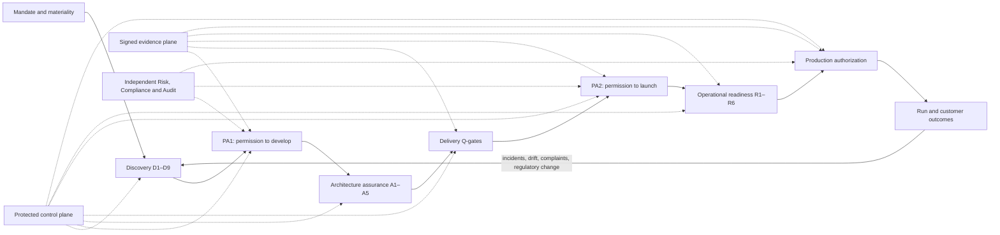

# Loom 2.0 — implementation plan

**Status:** proposed · **Date:** 2026-07-22 · **Owner:** middleleap-loom plugin
**Inputs:** the Loom 1.9 bank-grade review, the "Harness 2.0" proposal, and two
plan reviews verified against this repository.

Loom 2.0 evolves the Loom from a repository-based AI-SDLC method into a
**policy-driven bank product-engineering operating system**: one traceable
control chain from mandate to customer outcome. The name stays **Loom 2.0** —
in the canon, *harnesses* are components of the Loom (discovery, delivery), and
the new planes are named for what they are: product assurance, architecture
assurance, operational readiness.

The Loom does not replace Risk, Compliance, Internal Audit, Operations, or a
bank's New Product Approval process. It **orchestrates and evidences** those
functions.



---

## 0 · Verified baseline (what is actually true today)

Facts checked in-repo on 2026-07-22 — the plan builds on these, not on the
review's stale premises:

- The repo is at **1.9.0 in both `plugin.json` and `marketplace.json`**. There
  is no diverged installed copy to import and no packaging contaminants
  (`.DS_Store` etc.).
- `node scripts/validate-marketplace.mjs` passes.
- The **adopted-layout dry-run already exists** in
  `.github/workflows/validate.yml` and runs **106/106 tests green**; all six
  shipped gates (`control-plane`, `model-provenance`, `evidence-seal`,
  `data-lifecycle`, `operations-signal`, `discovery-link`) run clean on the
  bundled templates.
- Known false greens, demonstrated: the placeholder team
  `@your-org/platform-admins` in `CODEOWNERS.template` **passes** the
  control-plane gate; the model-provenance gate accepts `result: "pass"` as a
  declaration; the evidence-seal gate verifies chain integrity but never opens
  the sealed artifacts.
- Known false claim: `references/bank-grade-gap.md` grades "Q1b
  anti-reward-hacking gate — Enforced" for the bundle, but **no Q1b script
  ships** (only the `test-tripwire.sh` hook). Q2/Q4 scanner fills are
  explicitly "ADOPT" seams in `ci.yml`.

## 1 · The Loom 2.0 contract — four promises

Becomes a new canonical document `skills/loom/references/loom-2.md`.

1. **Risk-proportionate delivery.** Every change is classified before work
   starts; the classification *compiles* the applicable gates, control
   functions, and evidence. A documentation fix does not take the route of a
   lending-decision model — and a high-risk product cannot call itself "just a
   software change."
2. **Evidence cannot be self-declared.** A valid result identifies what was
   tested, against which commit/model/prompt/environment, which executable
   test produced it, who or what ran it, when, where the immutable output is
   stored, and which authenticated authority accepted it.
3. **Agents are first-line participants only.** Agents discover, design,
   build, test, challenge, and prepare evidence. They cannot manufacture
   second-line approval, independent model validation, Internal Audit
   assurance, product-owner accountability, or production authorization.
4. **Shipping is not the end.** A product stays inside the Loom while running:
   incidents, complaints, drift, control failures, SLO breaches, and
   regulatory change route back into the product's risk and discovery records.

## 2 · Architecture: core, profiles, adapters

```text
Loom Core                          (generic, solution-agnostic)
├── lifecycle + evidence schemas
├── policy compiler
├── generic validators (gate runners)
├── identity + attestation contract
└── gate execution protocol

Profiles                           (pure data: JSON schemas + policies)
├── regulated-bank/                (product approval, three lines, resilience,
│                                   financial integrity, model risk, prod auth)
├── jurisdictions/uae-bank/        (CBUAE product governance, CPS, PDPL +
│                                   residency, model management, notification,
│                                   Islamic-finance applicability)
└── products/                      (deposits, lending, payments, investments,
                                    open-finance, islamic)

Adapters                           (neutral contract, reference mappings)
└── branch protection · CI/CD · IAM/PAM · vault · GRC · model inventory ·
    incident mgmt · observability · WORM evidence store · obligations register
```

Bundled layout:

```text
plugins/middleleap-loom/skills/loom-adopt/harness/
├── core/{schemas,policies,attestations,evidence}/
├── profiles/{regulated-bank,jurisdictions/uae-bank,products}/
├── adapters/
├── scripts/          (gates)
├── governance/       (runbooks, templates)
└── ci/
```

**Rules learned from review:**

- Profiles are **data, not prose**. The Claude.ai-canonical Open Finance /
  bank-risk skills inform profile *authoring*; they are never a runtime
  dependency of gate *execution* (they sync manually and would make a
  compliance profile drift-prone). If the UAE profile grows large it moves to
  a sibling plugin (`middleleap-loom-uae`) that installs independently, with
  graceful degradation when absent.
- **Every section of this plan carries the boundary split**: *bundle ships /
  adopter activates / activation evidence*. The bundle can ship schemas,
  compiler, validators, reference gates, profiles, adapter contracts, negative
  tests, and playbooks. It cannot ship authenticated identities, signatures,
  immutable storage, an org chart, or a pilot.
- The marketplace validator is extended to validate the new
  `core/ profiles/ adapters/` layout.

## 3 · Maturity model — five states (Absent stays)

Replaces the three-state model in `bank-grade-gap.md`. "Absent" is retained:
without it, "not present at all" collapses into "documented," which is the
truth-inflation this plan exists to end.

| State | Meaning |
|---|---|
| **Absent** | The capability is not present in the harness or the adoption at all |
| **Defined** | Requirement exists only in documentation |
| **Mechanically validated** | A gate validates a declaration or artifact |
| **Platform enforced** | A non-bypassable technical control enforces it, with a negative bypass test |
| **Organisationally enforced** | Independent authority, operating process, and evidence exist |

Grading rule: a gate that validates a *declaration* is **mechanically
validated**, never "enforced." Platform-enforced requires the six conditions
in §6. The hand-maintained scorecard in `bank-grade-gap.md` is **replaced** by
the control catalog (§11) as the single source of control state; the reference
file becomes a narrative view generated from it.

## 4 · One governed change object

`change-envelope.json` is the root of the traceability chain
(mandate → discovery evidence → requirements → obligations → risks → controls
→ tests → build artifacts → approvals → release → runtime outcomes). Every
artifact carries the same `change_id`, product id, and release commit.

```json
{
  "change_id": "CHG-2026-0042",
  "product_id": "PRD-017",
  "change_type": "material-product-change",
  "risk_tier": "high",
  "discovery_run": "credit-limit-review",
  "required_profiles": ["regulated-bank", "uae-bank", "retail-credit"],
  "current_state": "permission-to-develop",
  "control_plan": "controls/CHG-2026-0042.json",
  "evidence_bundle": "evidence/CHG-2026-0042/"
}
```

**Migration (explicit, to avoid two parallel traceability systems):**

- The envelope becomes the root; `docs/backlog.yaml` items reference an
  envelope rather than carrying parallel state.
- `discovery-link-check.mjs` (the waist gate) becomes a compiled control that
  reads the envelope.
- **State transitions require gate evidence.** `current_state` may only
  advance when the evidence bundle contains the passing envelopes for that
  transition — otherwise the envelope is one more self-declaration. The
  transition check is itself a gate.

## 5 · The policy compiler

The most important new core component — and the highest-value tamper target,
so it is treated as control plane from day one.

**Inputs:** change type, product type, customer/financial impact, data
classification, AI/model involvement, core-banking involvement,
critical-service involvement, third-party involvement, jurisdiction,
Islamic-finance applicability, notification requirements.

**Output:** a compiled control plan — required gates (`D1–D9, PA1, A1–A5,
Q1–Q5, PA2, R1–R6`), required approvers by role, required evidence types.

**Rules:**

- An unclassified change is blocked. Missing profiles are blocked.
- **Monotonicity invariant:** higher-risk classifications add controls; they
  never remove mandatory lower-tier controls. This is the compiler's core
  property test — written first.
- Exemptions require an authenticated owner, rationale, compensating control,
  expiry, and second-line approval. Expired exemptions block.
- **The agent cannot lower the risk tier — by mechanism, not aspiration:**
  the classification fields live in a file owned via CODEOWNERS by a
  non-builder group, and classification provenance is recorded in the
  envelope. A materiality disagreement routes to a human before development.
- The compiler, its policy files, and every profile join `CONTROL_TARGETS`.
- The **compiled control plan is itself a sealed evidence artifact**, and a
  reconciliation check fails the release if the gates actually executed differ
  from the compiled plan — classification-time rigor cannot be defeated at
  execution time.

## 6 · Evidence envelopes replace gate declarations

Every gate returns a standard envelope:

```json
{
  "gate": "Q4-supply-chain",
  "status": "pass",
  "change_id": "CHG-2026-0042",
  "commit": "abc123",
  "environment": "controlled-build-17",
  "executed_by": "agent-service-42",
  "executed_at": "2026-09-14T08:31:00Z",
  "policy_version": "uae-bank@2.0.0",
  "artifacts": [{ "type": "sarif", "ref": "q4/code-scan.sarif", "sha256": "…" }],
  "attestation": { "issuer": "bank-ci", "signature": "…" }
}
```

A gate is **platform enforced** only when all six hold:

1. The evidence is generated by the control mechanism itself.
2. It is bound to the correct commit and environment.
3. The result is semantically validated (artifacts opened and checked, not
   just present).
4. The issuer is authenticated (§8's attestation contract).
5. A failing result prevents progression.
6. A negative bypass test exists.

**This applies to every new gate family (PA, A, R) from its first commit** —
new gates arrive with the same false-green risk the plan exists to cure.

**The attestation contract is named once, here, and referenced everywhere:**
signature verification uses platform-native attestation — sigstore/cosign
and/or the CI provider's OIDC-backed attestations — against an
**allowed-issuers registry** (`core/attestations/issuers.json`, CODEOWNERS-owned
by a non-builder group, carrying issuer identities and verification material).
A gate that merely checks a `signature` field is non-empty is a field check,
not a control. *Bundle ships:* the contract, the registry schema, and a
verification library with reference sigstore/GitHub-attestation mappings.
*Adopter activates:* real issuers and keys. *Activation evidence:* a signed
smoke attestation verified in CI.

## 7 · The gate families

### 7.1 Product assurance (PA plane) — the largest functional upgrade

Grounded in CBUAE Consumer Protection Standards (comprehensive product
approval, inherent-risk assessment, documented sign-off by management and
control functions) and CBUAE Operational Risk Art. 11 (new/materially changed
products and systems).

- **PA1 — permission to develop** (after Discovery, before substantial
  build). Artifact: `product-passport.json` — purpose and mandate, new vs
  material change, target market and excluded segments, customer need and
  foreseeable harm, inherent risk ratings, applicable profiles, preliminary
  economics, data and model use, systems and third parties affected,
  notification/non-objection, applicable control functions, named product
  owner and accountable executive, the decision itself. PA1 confirms the bank
  is willing to *design* under the identified risk — it does not approve the
  product.
- **PA2 — permission to launch** (after built and tested, before production
  authorization). Final terms, pricing/fees/profit calculations, suitability
  and affordability, Key Facts Statement + Arabic + accessibility,
  vulnerable-customer treatment, conduct controls, complaints readiness,
  AML/sanctions/fraud/misuse, accounting and ledger treatment, reconciliation
  and settlement, regulatory reporting, credit/capital/liquidity/treasury
  effects, Shariah approval where applicable, security/privacy/residency,
  model validation and usage limits, operational readiness, post-launch
  outcome measures, authenticated approvals.
- **Gate family P1–P8:** classification/materiality · target market and harm ·
  pricing/disclosure/conduct · financial crime · finance/ledger/prudential ·
  legal/notification/Shariah · required approvals and open conditions ·
  post-launch monitoring plan. Mounted through profiles, so a payments product
  and a lending product compile different requirements.

Risk-tiered approvals (low → product owner + engineering; medium → + Risk,
Compliance, Legal, Operations; high → all applicable control functions +
accountable executive; critical → + second-line hold, board/CAB, regulatory
clearance where required). Approvals are attestations under §6 — a text field
with a name does not count.

*Bundle ships:* schemas, P-gates, profile data, PA1 extension of the waist
gate. *Adopter activates:* the actual approvers and their identities.
*Exit criterion:* a high-risk product cannot enter Develop without PA1 or
reach production without PA2 — with negative tests.

### 7.2 Architecture assurance (A plane)

Artifact: `architecture-assurance.json`. A material unresolved A-gate blocks
backlog creation (enforced as a waist-gate extension).

- **A1 data & privacy** — inventory, classification, purpose/lawful basis,
  flows and residency, retention/erasure, encryption/tokenisation/keys,
  access logging, lineage and reporting dependencies.
- **A2 security & threat model** — the product *and the AI harness itself*:
  prompt injection via repo content, poisoned context, agent exfiltration,
  credential misuse, guardrail modification, malicious dependencies, evidence
  forgery, agent/reviewer collusion, unauthorised tool execution,
  model-provider compromise, core-banking transaction duplication. Requires
  threat → control → test traceability.
- **A3 operational resilience** — critical-service classification, dependency
  map, single points of failure, degraded mode, recovery design, third-party
  substitutability, data recovery and reconciliation.
- **A4 model & AI risk** — purpose, materiality/tier, decision boundaries,
  human override, evaluation plan, monitoring plan, suspension thresholds,
  independent-validation requirement (CBUAE Model Management Standards expect
  lifecycle governance, not just inventory and pinning).
- **A5 core & financial integrity** — idempotency, maker-checker, posting and
  reversal rules, source-of-truth boundaries, reconciliation,
  failed-transaction recovery, audit immutability, EOD/reporting effects.

### 7.3 Technical Q-gates — hardened and completed

- **Q1** build/unit/component, generated-artifact consistency, coverage
  policy, reproducible build id.
- **Q1b — ship `test-integrity.mjs`** (the currently missing anti-reward-
  hacking gate): removed/weakened assertions, added skips/focus/expected-
  failure, coverage reduction without approval, deleted negative tests,
  snapshot broadening, fixture changes that remove risk cases — with an
  approved test-change process, not a blanket prohibition. Defence in depth
  with the existing `test-tripwire.sh` hook.
- **Q2** SAST + IaC/config policy + dangerous-API/egress + authorization-
  policy analysis, with **output validation** (SARIF opened and thresholded,
  not just "the scanner ran").
- **Q3** contract tests, real local stores, layered authorization,
  idempotency/replay, maker-checker, ledger and reconciliation tests, fault
  injection, downstream timeout/recovery.
- **Q4** SCA, container scan, SBOM, signed build provenance, current-tree
  **and history-aware** secret scans, dependency policy, base-image
  verification.
- **Q4.5** store inventory, lineage emission, audit immutability,
  log-redaction, reporting traceability.
- **Q5 renamed: "delivery-complete", not production approval.** Q5 packages
  the candidate release for PA2 and operational readiness.

Existing gate hardening (from the verified false greens):

- **Control plane:** reject placeholder CODEOWNERS teams (the shipped
  template must *fail* until filled); protect every gate/manifest/workflow/
  hook, not representative files; require activation evidence (branch
  protection settings + a rejected-direct-push probe); record agent identity
  and verify it is not an approver (via platform API at CI time, or
  activation evidence — a static repo check cannot do this).
- **Model provenance:** require the evaluation artifact (hashed and sealed),
  dataset/runner versions, thresholds, timestamps; resolve `validated_by`
  against the identity registry (§8); fail when evaluator or validator is in
  the builder group.
- **Evidence seal:** validate **semantics** of sealed artifacts — tests
  actually pass, reviewer verdicts are PASS/CONFORMANT, evidence commit
  matches the released commit, model and control-plane results relate to that
  release; require an external anchor for high-risk releases.
- **Data lifecycle:** reconciliation against actual stores/schemas/topics via
  the **adapter seam** (adopter-supplied inventory exporters) — a bundled
  gate cannot see a bank's stores; require execution evidence for deletion,
  crypto-shredding, and legal holds.
- **Operations feedback:** resolve links to real objects (incident id, SLO
  measurement, complaint trend, CVE, drift result, regulatory publication,
  risk record, discovery run, remediation PR) with owner, due date, status,
  customer/financial impact, closure evidence, second-line review for
  material signals. **An empty operations manifest is valid before launch and
  fails once a production authorization exists.**

### 7.4 Operational readiness (R plane) and production authorization

Artifact: `service-readiness.json` — critical-operation classification,
service owner, customer/financial impact, SLOs and error budgets, disruption
tolerance, RTO/RPO, BIA reference, dependency inventory, third-party
continuity and exit, capacity/stress results, on-call and escalation,
incident classification, regulatory-notification triggers, recovery
procedure, rollback + latest drill, kill-switch + latest test, reconciliation
after recovery, customer communication, complaints readiness. (BCBS
operational-resilience principles treat these as connected components.)

Gate family **R1–R6** validates it, including freshness windows (an expired DR
exercise, untested rollback, or missing kill-switch blocks production —
freshness is checkable; the *truth* of a drill is an attestation, stated
honestly as such).

**Production authorization is separate from code merge:**

```text
Production authorization =
    technical gates green
  + PA2 product approval
  + operational readiness green
  + model validation where applicable
  + no unapproved material exceptions
  + second-line hold released
  + accountable executive approval
  + evidence externally anchored
```

The second line can hold a release; builders and agents cannot release the
hold (the hold is a status file owned via CODEOWNERS by the second-line
group, checked by the authorization gate). Internal Audit does not approve
releases — it independently assesses whether first- and second-line controls
operate.

## 8 · Identity and authority model

Roles: agent service identity, engineer, product owner, platform admin,
security, risk second line, compliance, legal, model validator,
operations/SRE, accountable executive, internal audit.

*Bundle ships:* an identity registry seam (`core/attestations/identities.json`,
owned by a non-builder CODEOWNERS group) mapping identities to roles,
products, jurisdictions, and decision types; a **disjoint-membership gate**
(builders ∩ second line = ∅, agent ∉ approvers); resolution of every
`validated_by`/approver field against the registry; the attestation contract
(§6). `validated_by: "Risk"` fails — it must resolve to an authenticated
identity authorised for that product, jurisdiction, and decision type.

*Adopter activates:* short-lived workload identity, no shared credentials,
vaulted scoped secrets, separate build/deploy identities, no agent production
credentials, no agent merge/approval rights, delegation with expiry, session
and tool-use audit.

*Activation evidence:* IAM export reconciled against the registry on a
schedule; a rejected agent-self-approval probe.

## 9 · Independent evidence plane

The existing hash chain grows into a release record containing: release
commit and artifact digests, the full compiled control plan, every gate
envelope, product and architecture approvals, model evaluations and
validation, SBOM and provenance, operational-readiness evidence, exceptions
with expiry, deployment evidence, post-release verification.

For high-risk releases: sign the evidence root, publish to external WORM
storage, apply a trusted timestamp, give Internal Audit read-only access,
support independent re-performance of the seal and control-plan evaluation.
**The repository copy is a convenience; the external store is the record.**
(*Bundle ships:* the record schema, signing/anchoring hooks, re-performance
tooling. *Adopter activates:* the WORM store and timestamp authority.)

## 10 · Model risk and continuous assurance

Per AI role: owner, provider + immutable model id, system prompt + harness
version, allowed tools/data, expected and prohibited use, materiality/tier,
evaluation suite + dataset, thresholds, independent validator, monitoring
metrics, override rules, suspension triggers, fallback (model or manual),
incident history. Evaluation categories: task completion, contract adherence,
control compliance, hallucinated evidence, test manipulation, scope
expansion, data leakage, prompt-injection resistance, tool misuse, unsafe
code, reviewer agreement, repeatability across model/provider changes.
Proportionality: a coding model is not a credit model, but the lifecycle
principles apply to both. Changing a model, system prompt, or critical tool
configuration requires a fresh evaluation, independent validation, and
resealed evidence.

Continuous assurance becomes executable across all six steps — watch
(regulatory/vulnerability/certificate/model/control-drift feeds), assess
(materiality and routing), check (policy/contract/product/architecture
conformance), test (scheduled control tests), evidence (signed envelopes +
anchor), confirm/report (authenticated human authority). Each scheduled run
produces a signed cycle record and an unresolved-findings register.

## 11 · Control catalog — the institutional brain

`control-catalog.json`: stable control id, objective, applicable risks and
regulations, applicable profiles/product types, owner, line-of-defence
responsibility, enforcement mechanism, evidence type, frequency, tier
applicability, failure severity, compensating-control rules, last/next test,
current effectiveness, exceptions. The policy compiler selects from the
catalog — product teams never copy controls into documents manually. The
catalog **replaces** the `bank-grade-gap.md` scorecard as the source of
control state.

## 12 · Enterprise adapters

The Loom integrates with, but never owns: branch protection, CI/CD, work
management, change management, IAM/PAM, vault, GRC register, model inventory,
incident management, observability, WORM store, obligations register. One
neutral adapter contract exchanging signed evidence envelopes; reference
mappings for common systems; core stays vendor-neutral.

## 13 · Release train (no big-bang)

Every release: version bump in **both** `plugin.json` and `marketplace.json`
(the repo rule), canon/doc updates in the same release, and an explicit
**ofbo back-port/forward-port step** — hardened gates diverge from their
upstream copies in `ofbo/discovery/`, and the dry-run catches breakage, not
drift.

### 1.9.1 — Truth pass (small; the baseline is already clean)

- Fix `bank-grade-gap.md`'s "Q1b Enforced" claim for the bundle.
- Make the shipped `CODEOWNERS.template` placeholder **fail** the
  control-plane gate until replaced (kills the demonstrated false green).
- Record the current scorecard as the 2.0 baseline.
- *Explicitly not needed (verified done):* importing installed changes,
  fixing marketplace validation, establishing adopted-layout testing.

### 1.10 — Truthful enforcement

- Five-state maturity model (§3) applied across the canon.
- Control catalog (§11) replacing the hand-graded scorecard.
- Harden the six existing gates (§7.3) with semantic evidence validation.
- Ship Q1b `test-integrity.mjs`; Q2/Q4 output validation; history-aware
  secrets scan; SBOM/provenance verification.
- Negative bypass tests for every control claimed platform-enforced.
- **Exit:** every platform-enforced claim has a demonstrated rejected bypass;
  no control is called enforced because a field exists.

### 1.11 — Bank profile preview

- Policy compiler + change envelope + migration of waist gate and backlog
  linkage (§4–5).
- PA1/PA2 + P-gates; A1–A5; `regulated-bank` profile + `uae-bank`
  jurisdiction profile + two product profiles (materially different, e.g.
  payments and lending).
- Attestation contract + identity registry seam + disjoint-membership gate.
- Marketplace-validator extension for the new layout.
- **Exit:** a high-risk change cannot enter Develop without PA1; compiled
  plan vs executed gates reconciliation fails on mismatch; monotonicity
  property test green.

### 1.12 — Production-control preview

- R-gates + `service-readiness.json`; compound production authorization
  replacing "Q5 = a human approved"; second-line hold seam; external anchor
  hooks; executable continuous assurance; operations-manifest
  fails-after-launch rule.
- **Exit:** expired DR exercise, untested rollback, missing kill-switch,
  unresolved high-severity finding, or held release blocks production — each
  with a negative test.

### 2.0 release candidate

- Complete bank profile; adapter reference mappings; model-risk lifecycle
  complete (§10); pilot playbook + adversarial-exercise checklist shipped.
- **Adopter-side (ofbo or a real adopter — not closable in this repo):**
  supervised production pilot per §14, independent risk review,
  internal-audit re-performance.

### 2.0 stable

Only after pilot findings are resolved or formally accepted and an adopter
demonstrates platform **and** organisational controls operating — not merely
that templates exist. **Stated plainly: 2.0-stable is deliberately contingent
on evidence from outside this repository.** Published limitations and
adoption runbook accompany the release.

## 14 · Pilot strategy (adopter-side; the bundle ships the playbook)

Scope: customer-facing enough to exercise conduct controls; real integration
but no autonomous core posting on day one; capped exposure; reversible;
observable; manual fallback; dual-run/shadow where possible; embedded
second-line oversight; pre-agreed customer remediation.

Stages: synthetic rehearsal → controlled internal users → staff/customer beta
without financial execution → capped production cohort → expanded cohort
after second-line review → normal operation on exit criteria.

Required adversarial exercises: agent direct push; agent modifies a gate;
placeholder approval; builder impersonates second line; stale model eval;
missing eval artifact; tampered **and fully recomputed** evidence; malicious
repository instruction; PII egress; vulnerable dependency; incorrect pricing
or fee; duplicate financial transaction; failed reconciliation; third-party
outage; rollback failure; model-provider outage; critical complaint or
vulnerable-customer harm; regulatory change mid-delivery.

## 15 · Delivery organisation (adopter-side accountabilities)

Harness product owner (method + roadmap) · platform engineering (control
plane, CI, identity, evidence) · product/business (need, economics,
ownership) · engineering (first-line controls) · Risk/Compliance (independent
challenge, release conditions) · InfoSec (threat and security policy) · Model
Risk (inventory, validation, monitoring) · Data Protection (lifecycle,
rights, residency) · Operations/SRE (readiness, resilience, incidents) ·
Internal Audit (independent assurance) · accountable executive (risk
acceptance, cease-use). **No single function both owns the Loom and
independently attests to its effectiveness.**

## 16 · Success measures

**Measurable in this repository (CI-verifiable):**

- 100% of platform-enforced controls have a passing negative bypass test.
- Zero placeholder owners, approvers, or evidence references pass any gate.
- 100% of gates emit conformant evidence envelopes bound to commit +
  environment.
- Compiled-plan vs executed-gates reconciliation green on every release.
- Docs gate (Q2b) green — canon, `loom-stream.html`, and references updated
  with every release.

**Attested by the adopter (activation evidence, sampled by audit):**

- 100% of product changes classified; 100% of material products through
  PA1 + PA2 with authenticated control-function approvals; zero expired
  exemptions at production authorization.
- Zero agent self-approvals or agent production credentials; second-line hold
  demonstrated; audit re-performance demonstrated.
- 100% of high-risk releases externally anchored.
- Delivery: mandate-to-production lead time, decision wait time, late-risk
  rework, % controls auto-evidenced, change-failure and rollback rate.
- Model risk: evaluation freshness, drift, control-violation rate, time to
  suspend an unsafe model.
- Customer/ops: complaints and remediation, pricing/disclosure defects,
  vulnerable-customer impacts, SLO attainment, RTO/RPO results, incident
  recurrence, signal-to-routed-action time.

## 17 · Definition of done

Loom 2.0 is done when all of the following hold:

1. Core and profiles are cleanly separated; profiles are data.
2. A risk classification automatically compiles the required path; the
   compiled plan is sealed and reconciled against execution.
3. Product approval is distinct from technical approval; production
   authorization is distinct from merge.
4. All enforced gates produce identity-bound evidence envelopes under the
   named attestation contract.
5. The agent cannot alter, approve, or bypass its own control plane —
   demonstrated by negative tests, not asserted.
6. Second-line Risk/Compliance can independently hold a release; builders
   and agents cannot release the hold.
7. Internal Audit can reconstruct and re-perform a release assessment from
   the evidence record alone.
8. Model usage, evaluation, monitoring, and suspension are governed across
   the lifecycle; any model/prompt/tool change re-triggers evaluation,
   validation, and resealing.
9. Operational readiness and resilience are production prerequisites.
10. Runtime signals close back into Discovery and the risk register; the
    operations manifest cannot be empty after launch.
11. A supervised production pilot has exercised normal and failure paths,
    independently assessed (adopter-side, per §13/§14).
12. Every claim distinguishes Absent / Defined / Mechanically validated /
    Platform enforced / Organisationally enforced.
13. The Loom still states plainly that adoption does not equal regulatory
    certification.

---

*Appendix — traceability to the reviews:* the corrections baked in here are:
the verified-clean 1.9.1 baseline (§0, §13); the five-state maturity model
retaining Absent (§3); the bundle/adopter boundary split applied per section
and to the success measures (§2, §16); the attestation mechanism named once
(§6); the compiler treated as control plane with a sealed, reconciled plan
(§5); the change-envelope migration story (§4); profiles as data with no
runtime dependency on Claude.ai-canonical prose skills (§2); negative tests
required for new gate families from first commit (§6); the control catalog
replacing the hand-graded scorecard (§11); doc/visualization updates and the
ofbo back-port step in every release (§13); and the "Loom 2.0" name (title).
