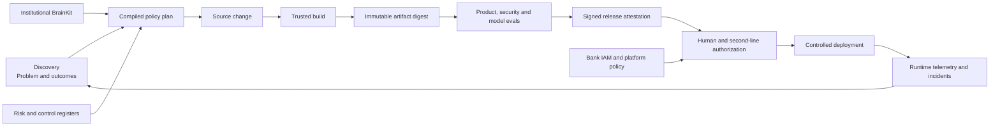

# Harness 2.0 — the control-plane plan (rc.11 → 2.0 GA)

**Status:** proposed · **Date:** 2026-07-24 · **Owner:** middleleap-loom plugin
**Input:** an external control-plane review of `origin/main@2cf680e` (v2.0.0-rc.10), every
claim of which was **verified against the code before this plan was written** — the findings
table below records what held, what was already fixed, and what was wrong.
**Companions:** `loom-2.0-plan.md` (original architecture) · `loom-2.0-rc7-plan.md`
(composition) · `loom-2.0-baseline.md` (release-by-release record).

The central change:

> Move the Loom from a repository-validation harness to a verifiable delivery control
> plane that binds institutional policy, source changes, immutable build artifacts,
> approvals, deployment and runtime evidence.

And the central discipline: **stop adding new gates until the release-evidence and
platform-enforcement foundations are corrected.** Without those foundations, additional
gates increase the *appearance* of control faster than actual control.

## 0 · Verified findings (the facts this plan stands on)

Each reviewed claim, confirmed or corrected at `2cf680e`:

| # | Review claim | Verdict | Evidence |
|---|---|---|---|
| F1 | Product evals are commit-bound and self-referential | **Holds, refined** | `product-eval-check.mjs:110–116` binds to the PR head sha (`--commit`, then `GITHUB_HEAD_SHA`). But the eval record is *committed inside* the commit it must name — so the eval provably ran before that commit existed. rc.10's head-sha binding makes PRs pass; it does not make the binding true. The assurance subject must move from the commit to the built artifact digest |
| F2 | Release evidence accepts a symbolic release identifier | **Holds** | `evidence-seal-check.mjs:123–125` requires `release_commit` to be *present*, not to be a real commit — the shipped `evidence-example/manifest.json` passes with `"release_commit": "release-v-demo"` |
| F3 | Platform controls are declared, not observed | **Holds** | `adapter-check.mjs` validates signed *envelopes about* branch protection; nothing queries the live platform. Catalog self-grade: **0 platform-enforced / 0 organisationally-enforced** across 47 controls (generated scorecard) — the bundle says so itself |
| F4 | Routine auto-merge relies on a permanently failing optional job that blocks ordinary PRs | **Already fixed in rc.10** | `ci/ci.yml:89–109`: `routine-qualified` is its own job/status context; ordinary PRs merge on the `gates` context alone. What remains missing is the trusted **controller** — the identity outside the coding agent that reads the qualification and enables auto-merge — and platform observation of the queue wiring |
| F5 | D6 is activated by CI configuration, not derived from the compiled profile | **Holds** | `discovery/gates/validate.mjs:247` reads `--require-register` / `LOOM_REQUIRE_REGISTER`; `core/policy-compiler.mjs` emits `required_gates` / `required_evidence` / `required_approver_roles` but nothing routes a register requirement into D6. Deleting one CI flag weakens a regulated build |
| F6 | Local guardrails are runtime-specific despite distribution "through a Codex marketplace" | **Half holds** | The marketplace is a **Claude Code** plugin marketplace (no Codex reference exists anywhere in the repo). But the substance stands: `hooks/settings.hooks.json` + the three shell hooks are Claude Code-specific, and nothing states which enforcement survives under other runtimes. The CI gates are the only runtime-neutral enforcement of record |
| F7 | Adoption is partly automated; configuration, activation and institutional verification are manual | **Holds** | `adopt.mjs` installs idempotently and reports source → destination → status; templates land `adopt-pending`. There is no machine-readable progression from installed → configured → validated → platform-activated → organisationally approved, and no signed adoption attestation |
| F8 | The assurance cycle validates records but does not operate the scheduler, telemetry or incident intake | **Holds** | `assurance-cycle-check.mjs` verifies signed six-step records; nothing generates cases from signals, tracks SLAs, or suspends autonomy on a runtime breach |

Two review claims were **corrected** before planning: F4's red-workflow complaint (closed by
rc.10 — the residual work is the controller, not the CI split) and F6's Codex premise. Both
workstreams below are re-scoped to the residual gap, not the stale symptom.

## 1 · Target operating model

The current Loom is strongest from Discovery through merge. Harness 2.0 extends the chain
to the thing actually running in production:



The source commit remains an input, but the primary assurance subject becomes the
**immutable artifact digest**. That dissolves F1's self-reference (an artifact digest is
computed *after* the commit exists, and evidence about it can never be inside it) and lets
the bank prove exactly what was evaluated, approved and deployed.

## 2 · Standing rules for every workstream

These are constraints the review under-specified; every workstream below inherits them.

1. **Extend, never duplicate.** The bundle already ships real ed25519 verification and an
   issuer registry (`core/attestations.mjs` + `attestation-issuers`), a sealed evidence
   chain (`evidence-seal-check.mjs`), lane-aware execution (`core/gate-runner.mjs`,
   `LANES = pr | release | scheduled`), and mandatory-when-compiled capability routing
   (rc.7 W1). New release-attestation, activation and adoption machinery composes onto
   these seams. A second, parallel signature or evidence system is a defect.
2. **Honesty invariant, unchanged.** No bundled gate may claim platform- or
   organisational-enforcement. A public plugin bundle ships *verification machinery,
   schemas, negative tests and a demo issuer*; key custody, live-platform credentials and
   attested observations are adopter-side by construction. Every "signed X" requirement
   in this plan means: verification bundled and negative-tested; issuance adopter-side;
   absence or staleness **fails** where a compiled plan requires it.
3. **One state of record.** The control catalog remains the single source of truth for
   control state; the five-state maturity model (absent / defined / mechanically-validated
   / platform-enforced / organisationally-enforced) is not forked. New adoption stages and
   activation evidence project *from* the catalog; they do not create a second ledger.
4. **The ofbo back-port is part of done.** Per the provenance rules, every gate change made
   here must be back-ported to `ofbo/discovery/` (no automated sync exists). Each release
   below lists the back-port as an exit item, not an afterthought — drift between the
   generic harness and the worked example is how false confidence re-enters.
5. **Fictional examples only.** New profiles and worked examples follow the Meridian Trust
   convention: neutral, fictional, never a real institution's policy. Real institutional
   instantiations (OFBO included) stay in their private repos.

## 3 · Release roadmap

| Release | Objective | Indicative duration |
|---|---|---:|
| 2.0.0-rc.11 | Immutable release subject + artifact-bound evidence (WS1) | 2–3 weeks |
| 2.0.0-rc.12 | Platform observation + routine-change controller (WS2) | 3–4 weeks |
| 2.0.0-rc.13 | Compiler-bound regulated capabilities + runtime-neutral guardrails (WS3, WS4) | 3 weeks |
| 2.0.0-rc.14 | Adoption state machine + assurance orchestration seams (WS5, WS6) | 3–4 weeks |
| 2.0.0 GA | BrainKit service model, comprehension controls, supervised pilot, independent validation (WS7, WS8 + adopter-side gates) | 6–8 weeks |

rc.11 and rc.12 are **blocking for any production pilot**. Versioning stays on the existing
`2.0.0-rc.N` train (both `plugin.json` and the `marketplace.json` entry bump together, or
adopters never receive the release).

---

## WS1 · Rebuild the release-evidence plane (F1, F2)

Priority: **P0 — blocking** · Target: rc.11

### Problem

The evidence bundle is internally consistent but does not independently prove that its
subject is the thing deployed: evals bind to commits that cannot contain their own evidence
(F1), and the seal accepts a symbolic release identifier (F2).

### 1.1 Introduce an immutable release subject

A canonical `release-subject.json`, sealed as the root of the release-lane evidence chain:

```json
{
  "schema_version": "1.0",
  "source": {
    "repository": "org/repo",
    "commit": "40-character-sha",
    "tree_digest": "sha256:..."
  },
  "artifact": {
    "name": "service-image",
    "uri": "registry.example/service@sha256:...",
    "digest": "sha256:..."
  },
  "build": {
    "builder_identity": "github-actions://org/repo/workflow/release",
    "workflow_ref": "...",
    "run_id": "...",
    "built_at": "..."
  }
}
```

The artifact digest becomes the stable subject for all subsequent evidence. For
repositories that produce no deployable artifact (documentation, the harness itself), the
subject degrades explicitly to `{source}` with `"artifact": null` — stated, not implied,
and a compiled plan for a production-bound product **rejects** a null artifact.

### 1.2 Split declaration from attestation in product evals

The repository declares what must be evaluated; the trusted pipeline records what was:

- `product-eval-policy.json` (source-controlled): measures, datasets, thresholds, approved
  runners. This is the successor of today's `product-evals.json` *declarative* half.
- `product-eval-attestation.json` (CI-generated, never committed to the source tree):
  results bound to the **artifact digest**, signed by an approved workload identity from
  the existing `attestation-issuers` registry, stored as a release attachment or at an
  external evidence location named in the manifest.

`product-eval-check.mjs` keeps its PR-lane role (policy well-formed, measures trace to D1,
discovery linkage) and **loses** its commit-freshness role, which moves to the release lane.

### 1.3 Add the release-attestation verifier

`release-attestation-check.mjs`, composing `core/attestations.mjs` (verification) and the
evidence-seal chain (integrity), verifies:

- the artifact digest matches the promotion candidate;
- the source commit matches build provenance (and is a real 40-char sha — closing F2:
  `release_commit` gains format validation everywhere, and the shipped example is
  re-cut with a real digest chain so `release-v-demo` fails its own bundle test);
- product, security and model evaluations all name the **same** artifact digest;
- the attestation issuer is in the registry and approved for the claimed identity class;
- signatures verify; dataset and runner versions are approved by the eval policy;
- evidence freshness windows hold;
- every compiled requirement has a corresponding evidence receipt (reusing rc.7's
  aggregated-plan machinery — required types come from compiled plans, not a hardcode);
- the deployed digest (when a deployment receipt exists) matches the authorized digest.

### 1.4 Extend the lane model

`LANES` grows from `pr | release | scheduled` to `pr | build | release | deploy |
scheduled`. Lane assignment stays governed data in the control catalog (the rc.12
gate-runner design), so this is a vocabulary extension plus catalog entries — not a new
runner. The `deploy` lane's verifier is bundled as a CLI the adopter wires into their CD
pipeline; the bundle proves it fails closed, the adopter's wiring is what the WS5
activation report attests.

Release-evidence checks stop running as if they were PR-source checks: the reference CI
moves `evidence-seal-check` and the new attestation verifier to the release lane, and the
PR lane keeps source integrity, discovery linkage, architecture, tests and policy
compilation.

### Acceptance tests (all negative-tested in CI)

- Reusing valid evidence for a different artifact digest fails.
- Changing one byte in the artifact fails (digest mismatch).
- A product evaluation against the PR head but not the built artifact fails the release lane.
- A merge-group SHA does not invalidate an artifact-bound evaluation (the rc.10 pain,
  structurally gone).
- A source commit with no trusted-builder provenance fails.
- A valid source → artifact → deployment chain passes.
- `release-v-demo` (or any non-sha `release_commit`) fails — including the shipped example
  as previously cut.
- External anchor + signature verification are mandatory at high/critical tiers
  (extending the rc.12 compound-authorization rule, not restating it).

---

## WS2 · Make platform enforcement real (F3, F4-residual)

Priority: **P0 — blocking** · Target: rc.12

### Problem

The Loom validates *declarations about* branch protection, identities and approvals
(`adapter-check` envelopes). It does not observe the platform, and no control has ever
graded above mechanically-validated. The routine lane is CI-legible since rc.10 but has no
trusted controller.

### 2.1 Platform activation adapters (read-only observation)

An adapter interface, GitHub first:

```json
{
  "platform": "github",
  "repository": "org/repo",
  "checks": {
    "branch_protection": {},
    "rulesets": {},
    "required_reviews": {},
    "codeowners": {},
    "workflow_permissions": {},
    "environment_protection": {},
    "oidc_subjects": {}
  }
}
```

A read-only activation command queries the live platform and emits **signed activation
evidence** (issuer: an observer identity in the registry, constrained to be outside the
coding agent's write authority). The bundle ships the querier, the schema, the verifier
and a recorded-fixture test mode; a live observation necessarily runs adopter-side with
adopter credentials — rule 2 applies.

### 2.2 Graduation to `platform-enforced`

A catalog control may move to `platform-enforced` only when **all** hold:

- the platform adapter observes the active mechanism;
- a negative bypass test has been *executed against the platform* (not simulated);
- the observation and test result are signed and within freshness windows;
- the observed configuration matches the control catalog's declaration;
- the observing identity is outside the agent's write authority.

`control-catalog-check` enforces this: a catalog row claiming `platform-enforced` without
a verifiable activation receipt **fails the build** — the catalog still cannot overstate
itself, now one state higher.

### 2.3 The routine-change controller

rc.10 already gives the platform a clean signal (`routine-qualified` as its own status
context; ordinary PRs unblocked). What ships now is the reference **controller**:

1. The Loom classifies the PR; `routine-qualified` produces a signed qualification result.
2. A trusted bot identity — registered in `identities.json`, disjoint from the coding
   agent and from approvers — reads the result.
3. The bot enables auto-merge **only** for a qualifying PR; any control-plane, contract,
   data-model or institution-context change is ineligible (the existing routine floor).
4. Ordinary PRs stay on the human-review route; the `routine-qualified` context reports
   **neutral/skipped** for them via the controller (closing the last cosmetic residue of
   F4 — a by-design red context on every ordinary PR).
5. Every auto-merge decision is written to the evidence record (decision-log entry +
   operations signal).

The bundle ships the controller as a reference GitHub App/Action with its identity
constraints negative-tested; running it is adoption, attested under WS5.

### 2.4 Continuous configuration reconciliation

A scheduled-lane control detects drift: required check removed · CODEOWNERS weakened ·
branch protection disabled · workflow permission widened · OIDC issuer changed · AI
identity added to an approval group · production environment protection weakened. Any
drift finding **suspends routine auto-merge automatically** (the controller reads the
reconciliation verdict before enabling anything) and opens an assurance case (WS6).

### Acceptance tests

- Agent attempts self-approval: rejected by the platform (live negative test, recorded).
- Agent modifies a protected workflow: Code Owner review required.
- Agent disables a required check: rejected, or detected and routine autonomy suspended.
- Routine claim with a renamed control-plane file: rejected (rc.10's `--no-renames` rule,
  re-proven at the controller).
- Routine PR qualifies and auto-merges; the identical PR without a qualification cannot.
- Ordinary PR completes with `routine-qualified` neutral — no red context anywhere.
- Stale platform activation evidence fails; a catalog row claiming `platform-enforced`
  without a fresh receipt fails.

---

## WS3 · Bind regulated requirements into the compiler (F5)

Priority: **P0/P1** · Target: rc.13

### Problem

D6 fails-when-absent only under `--require-register` — CI configuration, not compiled
policy. The mandatory-when-compiled mechanism this needs has existed since rc.7; D6 was
never routed through it.

### 3.1 Compile required capabilities, not only gate families

The compiler's plan output (today: `required_gates`, `required_evidence`,
`required_approver_roles`, passport sections) gains `required_capabilities`:

```json
{
  "required_capabilities": {
    "data_risk_register": { "required": true, "minimum_version": "3.1", "institution_owned": true },
    "consumer_product_approval": { "required": true },
    "model_risk": { "required": true, "minimum_tier": "medium" }
  }
}
```

Monotonicity is preserved by construction (cumulative union across profiles — the existing
property test extends to capabilities): higher tiers only add requirements, never remove.

### 3.2 D6 mandatory-when-compiled

`validate.mjs` (and the reference CI) read the aggregated compiled requirement:
if any active profile requires `data_risk_register`, a missing register **fails with no
flag present**. `--require-register` / `LOOM_REQUIRE_REGISTER` survive as a manual
*tightening* override only — they can never weaken what the compiler requires. Under a
compiled requirement: demo/placeholder records fail · unapproved taxonomy versions fail ·
unresolved risks or controls fail · the approving risk owner must resolve through the
identity registry as a human with the role.

### 3.3 Product-type profiles

Composable, fictional-example-grounded reference profiles joining `lending` and
`payments`: retail deposits · consumer lending · SME lending · open finance · Islamic
financial products (Shari'ah governance capability — HSA/ISSC-shaped roles, drawing on the
`islamic-banking-uae` domain canon for shape, never for a real institution's policy) ·
internal bank tooling · material AI-assisted decision systems. Each compiles a distinct
set of approvals, evidence, operational readiness and monitoring requirements.

### Acceptance tests

- Removing `--require-register` does not weaken a regulated build (the flag's absence
  changes nothing once compiled).
- A generic non-regulated profile may omit the register (absent-OK stays true for
  unprofiled repos).
- A retail-lending change automatically requires consumer, credit, data and model-risk
  controls; an Islamic product automatically requires Shari'ah governance.
- Higher tiers only add requirements (property test extended to capabilities).

---

## WS4 · Runtime-neutral guardrails (F6, corrected premise)

Priority: **P1** · Target: rc.13

### Problem (as corrected)

Distribution is a Claude Code plugin marketplace — but the local hooks
(`settings.hooks.json`, `pii-guard.sh`, `spec-tripwire.sh`, `test-tripwire.sh`) are Claude
Code-specific, and the Loom nowhere states which protections evaporate when an adopter's
agents run elsewhere. The CI gates are the enforcement of record; local hooks are
defense-in-depth whose coverage is currently implied, not declared.

### Changes

A neutral guardrail policy with per-runtime adapters:

```text
guardrails/
  guardrail-policy.json
  adapters/
    claude-code/        # today's hooks, restated as an adapter
    github-actions/     # CI-side equivalents (the enforcement of record)
    local-git/          # pre-commit / pre-push
    <other-runtimes>/   # added per demonstrated demand, never speculatively
```

The policy describes events and decisions — before file write · shell execution ·
contract modification · test modification · network/data egress · commit · PR creation —
and each adapter translates what it *can* enforce. The **capability matrix** is generated
into the docs (doc-integrity-gated, like the copy table) so the Loom never implies
equivalent enforcement where a runtime lacks the hook. Where local enforcement is absent,
the matrix names the CI gate that backstops it.

### Acceptance tests

The same hostile scenarios run through every supported adapter, expected result recorded
per adapter (enforced locally / caught in CI / uncovered-and-declared): PII-shaped literal
· test weakening · contract modification · control-plane modification · unauthorized
egress · BrainKit content modification · missing parsing dependency (hooks fail closed —
the rc.10 `jq` rule, restated as policy).

---

## WS5 · Adoption as a controlled state machine (F7)

Priority: **P1** · Target: rc.14

### Changes

Five explicit stages replacing the single adoption status —
`installed → configured → mechanically-validated → platform-activated →
organisationally-approved` — with a CLI that wraps the existing machinery (`adopt.mjs`,
the gate suite, the WS2 activation adapters):

```bash
loom adopt        # = adopt.mjs (idempotent, manifest-driven — unchanged)
loom configure    # template fill-in with an explicit unresolved-marker inventory
loom verify       # run the bundled gates; = mechanically-validated
loom activate --platform github   # WS2 observation; = platform-activated
loom attest-adoption              # signed activation report; fails while any mandatory item is adopt-pending
loom status       # machine- and human-readable projection
```

`loom status` **projects from the control catalog** (rule 3 — no second ledger): per
capability, its installed/configured/validated/platform/organisation state, with
`adopter_side` rows honestly marked. Also in scope: first-install status reporting
corrected; provider-specific setup instructions generated from the catalog; verification
commands derived from the catalog rather than hand-listed.

### Acceptance tests

- `loom attest-adoption` fails while any mandatory item remains `adopt-pending`.
- A status row can never exceed the catalog's graded state for that control.
- Re-running any stage is idempotent; stages cannot be skipped (activation without
  verification fails).

---

## WS6 · Operationalize continuous assurance (F8)

Priority: **P1/P2** · Target: rc.14 (seams + verifiers) → GA (operated, adopter-side)

The bundle ships the **orchestration contract and its verifiers**; operating the
orchestrator is institutional work the pilot proves (rule 2).

- Adapter seams for: regulatory intelligence · SIEM/security events · observability ·
  model monitoring · incident management · GRC/control register · deployment platform ·
  product analytics — each an envelope schema + verifier, like the rc.6 enterprise
  adapters but with case-generation semantics.
- Case lifecycle, validated end-to-end:
  `signal → assess → map controls → run tests → assemble evidence → second-line decision
  → remediation or closure` — the existing signed six-step assurance-cycle record becomes
  the *output* of a case, not a free-standing ritual.
- Service-level expectations as data: critical-event assessment time · evidence freshness
  · remediation deadlines · escalation threshold · suspension trigger · revalidation
  cadence. A breached SLE is a finding; an overdue finding already blocks (rc.6 rule).
- Runtime breaches must be able to: open a finding · **suspend routine autonomy** (the
  WS2 controller reads this) · block release (release-lane check) · trigger
  rollback/model fallback (R-gate receipts) · route evidence into Discovery (operations
  signal, already wired).
- Accountable decisions remain human — the Loom validates and reconciles; it never
  approves.

---

## WS7 · BrainKit as an institutional service

Priority: **P2** · Target: GA

The rc.8/rc.9 BrainKit is digest-pinned local snapshots with a distribution runbook.
Evolve toward a controlled context service *as schemas and verifiers* (no live service in
the public repo — the rc.8 WS9 decision stands): central release registry · repository
adoption inventory · revocation and emergency withdrawal · impact analysis for changed
policy · compatibility ranges · repository acknowledgement receipts · context-quality
review cadence · source retirement tracking · a hard separation between authoritative
policy and explanatory guidance.

A BrainKit release must be able to answer: which repositories use it · which artifacts
were produced under it (now answerable via WS1's release subjects) · which controls
changed · which products need re-evaluation · whether an unsafe release can be revoked
across the estate.

## WS8 · Comprehension debt

Priority: **P2** · Target: GA

A human-understanding control, distinct from review-happened. For high-tier changes:
human-authored change summary · critical-path walkthrough · named code owner who can
explain the change · reviewer challenge questions · architecture and failure-mode
explanation · sample **replay of the agent decision log** (the rc.6 replayable log
finally earns its second consumer) · periodic manual reconstruction exercise.

Measured (reported, like token telemetry — never a merge gate at introduction): review
time · change complexity · percentage of agent-generated code · reviewer familiarity ·
post-merge defect rate · emergency-reversal frequency · the owning team's ability to
modify the component without the original agent session.

The objective is not to reduce AI output; it is to prevent delivery throughput from
outrunning institutional understanding.

---

## Programme ownership

| Workstream | Accountable owner |
|---|---|
| Evidence and attestations (WS1) | Platform Engineering + Security |
| Policy compiler and profiles (WS3) | Loom Core + Enterprise Risk |
| Routine autonomy (WS2) | Platform Security + Change Management |
| Product evaluation (WS1.2) | Product Management + Model Risk |
| Runtime guardrails (WS4) | AI Platform Engineering |
| Adoption machinery (WS5) | Loom Core |
| BrainKit (WS7) | Enterprise Architecture / Institutional Context Owner |
| Continuous assurance (WS6) | Compliance + Operational Risk |
| Comprehension controls (WS8) | Engineering Management + Second Line |
| Production pilot | Named Senior Manager |
| Independent validation | Second Line |
| Final audit assessment | Internal Audit |

The Loom team owns the machinery. It must not self-approve its regulatory sufficiency.

## Harness 2.0 GA exit criteria

Not production-ready until all of these are true — the first eight are bundle-provable,
the rest are the adopter-side gates the baseline has always named:

1. An immutable artifact is cryptographically bound to source, evaluations, approvals and
   deployment, and the full chain survives the WS1 adversarial substitution tests.
2. The release manifest cannot pass with a symbolic subject; the shipped examples fail
   their own historical bypasses.
3. A regulated profile cannot bypass D6 (or any compiled capability) by changing a CI flag.
4. Platform controls grade `platform-enforced` only on signed, fresh, live observation —
   and the catalog gate fails a claim without a receipt.
5. Routine auto-merge works in a reference repository with the controller identity
   separated, ordinary PRs unblocked and every decision evidenced.
6. Every supported runtime has a generated, doc-integrity-gated guardrail capability
   matrix; no implied coverage.
7. Adoption produces a signed activation report that cannot outrun the catalog.
8. Runtime incidents feed the assurance loop and can suspend autonomy, block release and
   trigger rollback — negative-tested end to end.
9. A supervised production pilot has completed rollback, kill-switch, recovery and bypass
   exercises.
10. An independent second line has validated the model and control design; Internal Audit
    has reviewed the evidence chain.
11. The ofbo instantiation has back-ported every gate change (rule 4) and runs green.
12. The bank can show which exact artifact was running, who approved it, under which
    BrainKit and controls, at any point during the pilot.

The sequencing decision that matters most: **fix artifact-bound evidence first (rc.11),
then prove platform enforcement (rc.12), then expand the assurance catalogue.** Until
those foundations hold, every additional gate increases the appearance of control faster
than actual control — and the Loom's one non-negotiable asset is that its greens are true.
