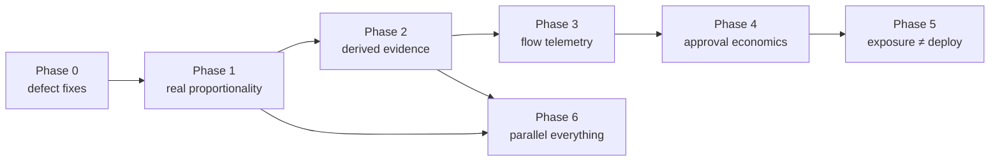

# Loom flow plan — faster regulated delivery without weaker control

**Status:** proposed · **Date:** 2026-07-28 · **Owner:** middleleap-loom plugin
**Inputs:** a four-track review of the harness at 2.0.0-rc.32 (core engine, the
~50 check scripts, profiles/governance/adapters, and the workflow skills +
canon), verified against this repository; `references/bank-grade-gap.md`; the
Loom 2.0 plan and its four promises.

`bank-grade-gap.md` grades the harness on **control credibility** — enforced,
independent, run-the-bank. This plan grades it on the axis that document
deliberately does not cover: **flow**. How long does a change take to move
from classified to in-production, how much of that time is machinery vs.
waiting, and does the harness get faster or slower as it is used? The review's
headline answer:

> **The control frame is strong and honest; the value stream is unmeasured,
> the risk-proportionate route decays with repo age, and the biggest delivery
> cost is evidence a human hand-authors that the machinery could derive.**

The plan keeps every fail-closed property, every monotonicity invariant, and
the one-sentence guardrail (agents build; humans stay accountable and merge).
Nothing here removes a control. The moves are: fix found defects, make the
risk-proportionate promise true at execution time, derive evidence instead of
authoring it, instrument the value stream, re-price approvals without
weakening them, and decouple deploy from release.

All paths below are relative to
`plugins/middleleap-loom/skills/loom-adopt/harness/` unless they start with
`plugins/` or `docs/`.

---

## 0 · What the review established (verified in-repo)

### 0.1 Strengths the plan must not damage

- **The plan is the route, and it is tamper-evident.** Recompile-and-compare
  on `plan_hash` (`scripts/change-envelope-check.mjs`) plus content-digest
  profile bindings including the live BrainKit digest
  (`core/policy-compiler.mjs`) mean you cannot classify strictly and execute
  loosely.
- **Monotonicity by construction.** Union-only accumulation; `standard ⊆
  regulated-bank` asserted by property test. A profile can only add.
- **Skips are recorded, never silent**; unknown diffs fail open toward more
  control (`core/gate-runner.mjs`).
- **Honest gaps instead of silent passes** — `UNVERIFIED-HERE` anchors, the
  generated scorecard, zero `platform-enforced` claimed as shipped,
  worked negative examples beside every gate.
- **The two-signature approval contract** (human assertion vs. bridge
  transcription, separate issuer registries, demo keys refused) and
  **temporal correctness** (authority judged at the signed decision instant,
  never at verification time — `core/identity-map.mjs`).
- **Per-story human cost is already right-sized**: one mandatory human act
  per story (the merge). The heavy ceremony is per governed change and per
  release — the correct factoring, and the place this plan optimizes.

### 0.2 Defects found (fix regardless of the rest)

| # | Defect | Where |
|---|--------|-------|
| D1 | `mergeCaps` is first-wins, not strongest-wins — its own docstring says "strongest attributes kept" but `cur.minimum_version \|\| spec.minimum_version` keeps whichever change was read first. Aggregating plans requiring `data_risk_register` ≥3.1 and ≥4.0 can report 3.1. Silent weakening — the exact bug class the harness exists to refuse. | `core/compiled-requirements.mjs` (~53–63); correct implementation already exists as `mergeCapabilities` in `core/policy-compiler.mjs` (~140–152) |
| D2 | The `build` and `deploy` lanes contain zero catalogued controls, yet `ci.yml` invokes both — two CI steps that structurally cannot fail. `ci-catalog-check` checks CI→catalog, not lane emptiness. | `ci/ci.yml` (~64–66), `core/gate-runner.mjs` |
| D3 | The weaker of two attestation stacks guards the release. `core/attestations.mjs` (used by evidence-seal, release-attestation, change-envelope) verifies issuer + ed25519 and stops: no `expires_at`, no `revoked`, no nonce, no `demo: true` refusal — while `core/approval-attestations.mjs` enforces all of them. The issuer template itself documents that "the older anchor gate does not read" the demo flag. | `core/attestations.mjs` (~29–46) |
| D4 | `manifest.anchor` is optional — a manifest with no anchor field skips anchor verification entirely and the seal gate passes. Only the change envelope demands an anchor, only at high/critical, only at `production-authorized`. | `scripts/evidence-seal-check.mjs` (~172) |
| D5 | `release_commit` is checked for 40-hex shape but never checked to exist in this repository or be an ancestor of the release ref. Evidence from a commit nobody ran passes. | `scripts/evidence-seal-check.mjs` (~129–134) |
| D6 | Path scoping matches by raw prefix: a control scoped to `docs/backlog.yaml` also matches `docs/backlog.yaml.bak`. And when two catalog controls share a `mechanism_ref` with different `mechanism_args`, the first control's args silently win while both are reported executed. | `core/gate-runner.mjs` (~52, ~55) |
| D7 | The manifest search paths differ between the seal gate and the release-attestation gate (`MANIFEST_LOCATIONS`), so the two gates can read **different manifests** in the same repo. | `scripts/evidence-seal-check.mjs` (~28) vs `scripts/release-attestation-check.mjs` (~32) |
| D8 | `execute: false` on a catalog entry is self-declared and unverified — a quiet path to disabling a control is to set the flag and write a plausible note. The CI comment says the list "is short ON PURPOSE"; a comment is not a gate. | `core/gate-runner.mjs` (~43), `scripts/ci-catalog-check.mjs` |
| D9 | `adopt.mjs` defaults to `--tier full` (the 133-ADOPT-marker cliff) while its own header and `assess.mjs` argue for `core`. | `adopt.mjs` (~189) |

### 0.3 The three structural flow problems

**F1 — Risk-proportionality decays to "run everything."**
`aggregateRequirements` unions the gate families of *every* change under
`docs/governance/changes/` with no state filter — and the change-state
machine has no terminal state (`STATES` ends at `in-production`), so every
change ever governed contributes its families forever. Any family in the
union becomes unskippable in its lane whatever the diff. One open critical
change makes a README-only PR carry the lending-model gate set; six months
in, path scoping is dead. This directly contradicts the gate runner's own
opening claim ("a documentation fix should not take the route of a lending
model"). Compounding it: the reference CI runs **all five lanes on every
PR**, four of them without `--base` (unknown diff → run everything), plus the
bundle's own 79-file test suite in every adopter's pipeline, and `loom
verify` runs only 3 of ~34 pr-lane gates locally — so the everyday loop is
push-and-pray with a full CI round-trip per governance mistake.

**F2 — The most expensive artifact set is hand-authored.**
Nothing in the harness writes the evidence manifest, `tests.json`,
`reviews.json`, `control-plane.json`, `model-provenance.json`, or
`release-subject.json`. `evidence-seal-check.mjs` contains a correct, tested
`buildChain()` — with no CLI, referenced nowhere in the release skill, which
instead instructs a human to "hash-chain the manifest." Release day is a
multi-hour ritual of hand-computing digests and transcribing gate verdicts —
which is not only toil but the "narrated, not sealed" risk the seal gate was
built to stop: a hand-typed `"PASS"` is exactly fabricatable evidence (G2 in
the scripts review). Drill dates (`last_drilled`, kill-switch every 90 days
per service) are diary entries, not observations.

**F3 — The value stream is unmeasurable from its own artifacts.**
The change envelope has a well-designed 8-state lifecycle and records **no
transition timestamps**. Operations signals have no `resolved_at` and no
`caused_by_change` link. The comprehension metrics the method calls its own
standing risk are collected and never read. Grep confirms: no lead time, no
cycle time, no deployment frequency, no change-failure rate, no MTTR
anywhere; every "DORA" hit is the resilience act, not the metrics. Nothing
reports approval queues — `product-approval-check.mjs` already *computes* the
missing-approvals set per change, then discards it into finding strings. A
bank adopting this cannot answer "did governance get faster or slower?" —
the question that decides whether the programme survives.

And the approval economics amplify F3: PA2 requires up to 12 role approvals
with 9 functions first engaging at permission-to-launch (the most expensive
place to discover an objection, while `pa1_approver_roles` sits unused in
almost every profile); approvals bind the *whole* `plan_hash`, so a one-byte
profile edit or BrainKit bump invalidates every signature on every in-flight
change; there is no delegation, no quorum, no release train, no
standard/emergency change class, and the routine lane's aperture is 40 diff
lines across three classes.

---

## 1 · Design principles (unchanged from the canon, restated as constraints)

1. **Nothing gates on time or cost.** Flow metrics, queue reports, and SLAs
   are telemetry in the exact posture of `scripts/token-report.mjs` — visible
   pressure, never a merge control.
2. **Selection may narrow only with a recorded reason**; unknown inputs fail
   open toward more control. A cache hit or a skip is as auditable as a run.
3. **Approvals are re-priced, never removed.** Standard changes, release
   trains, and delegation move approval from per-instance to per-envelope /
   per-train / per-deputy — each a second-line-owned, expiring, revocable
   grant, the trust model already proven by HG-0013.
4. **Evidence derivation strengthens control.** A gate-emitted artifact
   carrying the runner's identity is harder to fabricate than a hand-typed
   one. Deriving is not a shortcut; it closes G2.
5. **Monotonicity survives every change here.** New knobs (tiers on
   controls, change classes, freshness policy) can tighten an adopter's
   posture, never loosen it below the shipped floor.

---

## 2 · The plan

### Phase 0 — Fix what is broken (small, immediate, all cited above)

| Step | Fix |
|------|-----|
| 0.1 | D1: delete local `mergeCaps`, import `mergeCapabilities` from the compiler; add a regression test asserting order-independent strongest-wins. |
| 0.2 | D6: prefix match becomes `f === p \|\| f.startsWith(p.endsWith('/') ? p : p + '/')`; `ci-catalog-check` fails when two controls share a `mechanism_ref` with differing `mechanism_args`. |
| 0.3 | D2: the runner exits non-zero when CI explicitly invokes a lane that selects nothing — "an empty lane is a hole, not a pass" — until real `build`/`deploy` controls exist (Phase 5 adds them). |
| 0.4 | D3: `core/attestations.mjs` delegates verification to the approval-attestation core (or gains: `demo: true` refusal, issuer validity window, issuer revocation, `signed_at` inside the signed payload). One stack, the strong one. |
| 0.5 | D4 + D5: anchor becomes mandatory (near-free once Phase 2 derives it); `release_commit` must exist (`git cat-file -e`) and be an ancestor of the release ref. |
| 0.6 | D7: one shared manifest-location list in a new `core/governance-io.mjs` (see 2.6). |
| 0.7 | D8: extend `ci-catalog-check` — every `execute:false` control must name where it *is* executed, and the list is printed on every run like `REPORT_ONLY`. |
| 0.8 | D9: installer default flips to `core` (re-runs still honour `previous.tier`). |

**Exit criterion:** all existing tests green; new regression tests for D1,
D6, D8; a deliberate weakening (3.1-vs-4.0 capability, bak-file path match,
anchorless manifest, foreign commit) each demonstrably fails.

**Status:** 0.1–0.3 and 0.6–0.8 landed at rc.33. 0.4 (D3) and 0.5 (D4+D5)
were deferred to the Phase 2 fixture regeneration and landed at rc.36: one
unified attestation stack (demo refusal, issuer windows, revocation,
per-attestation validity) in `core/attestations.mjs`; the anchor mandatory;
`release_commit` verified to exist and be an ancestor of HEAD (not-performable
recorded aloud outside git). Every weakening in the exit criterion now
demonstrably fails — the anchorless-manifest and foreign-commit negatives run
in CI's dry-run (15b/15c) and in the gate's test suite.

### Phase 1 — Make risk-proportionality true at execution time (F1)

1. **Terminal states.** Add `closed` / `superseded` to `STATES` in
   `scripts/change-envelope-check.mjs`; `aggregateRequirements` filters to
   non-terminal changes. The requirement union stops growing forever.
2. **Per-diff requirement scoping.** `aggregateRequirements(cwd, {
   changedPaths })` counts only changes whose envelope directory or declared
   scope intersects the diff; the repo-wide union stays as `--all` for
   release/scheduled lanes. A README PR stops carrying an unrelated critical
   change's gate set.
3. **Tier-aware selection.** Optional `min_tier` on catalog controls;
   `select()` skips (reason recorded) controls above the max tier implicated
   by the diff. `always: true` and plan-mandated families override upward,
   never downward; unknown diff still fails open.
4. **The reference CI honours its own lane model.** `pr` lane per PR with
   `--base`; `scheduled` lane moves to a cron trigger (and gets `--base`
   where invoked otherwise); `release`/`deploy` lanes run on push/tag. The
   bundle's own 79-file test suite and the two bundle-only gates
   (`self-claims-check`, `discovery-sync-check`) move to a
   `bundle-selftest` job guarded off in adopted trees, keeping a small
   machinery-integrity smoke subset (`policy-compiler`, `gate-runner`,
   `layering` tests) in the adopter job.
5. **A local loop that matches CI.** `loom gates` (runner, pr lane, merge-base
   diff), `loom compile`, `loom classify` (scaffold an envelope), `loom seal`
   (Phase 2's collector) in `scripts/loom.mjs`, plus a `pre-push` hook
   template. With Phase 6's parallel runner this is a sub-minute local
   verdict — the CI round-trip is today's dominant cycle-time term.

**Exit criterion:** on a repo with one closed critical change and one open
low change, a docs-only PR demonstrably selects the small set with every
skip reasoned; wall-clock of the pr lane on this repo drops and the
`gate-run-*.json` records prove why.

### Phase 2 — Derive evidence; stop authoring it (F2)

1. **`scripts/seal-evidence.mjs`** — a `--write` CLI over the existing
   `buildChain()`: walk the evidence directory, hash artifacts, order by
   required types, set `release_commit` from git, emit the manifest, then
   immediately re-verify with the existing gate and refuse to write on
   failure. `skills/release/SKILL.md` calls it instead of narrating
   hand-chaining.
2. **Gates emit their own results.** Every gate gains `--emit <path>` writing
   `{gate, result, findings[], commit, run_id, runner_identity,
   produced_at}`; the runner wires it so `tests.json`, `reviews.json`,
   `control-plane.json`, `model-provenance.json` become gate *outputs*.
   Reviewer agents' verdicts are captured, not transcribed. This closes G2:
   "sealed **and produced by a run**" becomes checkable.
3. **The gate-run record becomes first-class evidence.** Runner captures
   per-gate output (Phase 6 removes `stdio:'inherit'`), signs the record via
   the (now unified) attestation core, and `gate-run` joins the evidence
   types. The most trustworthy artifact CI produces enters the chain instead
   of expiring as a CI artifact.
4. **Drills become signed observations.** `service-readiness` drill fields
   move from hand-typed dates to the observation shape already proven by
   `platform-activation-example/` (observation + bypass/negative test +
   observer outside builders + signature); a real rollback executed on smoke
   failure (`skills/release/SKILL.md` step on R3) is appended as drill
   evidence automatically — real incidents pay down drill freshness.
5. **Residency joins the signed world.** Replace the markdown-table scrape in
   `core/residency.mjs` with a signed JSON record verified through the
   approval-attestation core; keep the parser one release as a deprecated
   fallback via `upgrade-notes.json`.

**Exit criterion:** a release on the example tree is assembled end-to-end by
tooling with zero hand-computed digests; deleting the anchor, editing a
sealed artifact, or forging a verdict each fails the existing verifier
unchanged.

**Status:** items 1–3 landed at rc.35 — `scripts/seal-evidence.mjs` (+ `loom
seal`) derives, orders, chains, anchors and self-verifies the manifest and
refuses to write on any finding (CI proves it reproduces the worked example's
anchor from the artifacts alone); `core/gate-runner.mjs --emit-dir` emits one
result record per mechanism plus the run record with captured output; the
seal gate's semantics verify a sealed `gate-run` artifact (must be a passing
run at the release commit) without joining the required floor; the release
skill calls the collector instead of narrating hand-chaining.

Items 4–5 and the deferred D3/D4/D5 landed at rc.36 (Phase 2b): drills are
signed observations in the platform-activation shape (refused negative test,
non-builder observer, registered ed25519 signature; bare dates deprecated one
release with a printed notice); residency approvals are a signed JSON record
verified through the approval-attestation core (markdown parser deprecated
one release with a printed migration notice); and the committed
evidence-example is now deliberately refusable (demo anchor + fictional
commit), with `evidence-example/regenerate.mjs` re-deriving and re-signing it
per run in CI's dry-run — a fresh non-demo key registered into the adopted
registry, `release_commit` stamped to a real ancestor of HEAD, and the
demo-signed assurance cycle re-signed with it. The one item deliberately not
taken further: a real rollback executed on smoke failure appending itself as
drill evidence (the item-4 tail) — it needs the release skill's R3 smoke path
to emit an observation, which belongs with Phase 5's exposure work.

### Phase 3 — Instrument the value stream (F3)

1. **`state_history` on the envelope.** Append-only `[{state, at, by}]`,
   validated in `change-envelope-check.mjs`, reusing the decision-log chain
   idiom. One field makes lead time, stage residency, WIP age, and queue
   depth computable with zero new ceremony. *Highest-leverage single change
   in this plan.*
2. **`scripts/flow-report.mjs`** — modelled verbatim on `token-report.mjs`
   (telemetry, never a gate; `--check` validates shape only). Outputs: lead
   time (classified → in-production), stage-time histogram, deployment
   frequency (sealed manifests per period), change-failure rate, MTTR, gate
   wall-clock per lane from `gate-run-*.json` `ms`. Joins the
   `ci-catalog-check` by-name exemption list beside the token report.
3. **Link operations to changes.** `operations-signal.json` entries gain
   optional `caused_by_change` (resolving to a change id) and `resolved_at`
   — without these, CFR and MTTR are not derivable.
4. **`scripts/approval-status.mjs`** — the WIP/queue report:
   outstanding approvals per role per change with age, from the set
   `product-approval-check.mjs` already computes and discards. Plus
   `docs/governance/approval-sla.json` in the exact shape of the assurance
   SLA — breaches flagged in the report, deliberately non-gating.
5. **Trend the comprehension metrics.** `scripts/comprehension-report.mjs`
   trends `review_minutes` and `pct_agent_generated` per reviewer per
   milestone — the method's self-named standing risk is currently
   write-only.
6. **An exception register with a lifecycle.** Project every envelope
   exemption and assurance risk-acceptance into
   `docs/governance/exceptions.json` (scheduled lane): expiring-in-30/14/7
   warnings before the existing hard block, per-owner/per-control
   aggregation, concentration limits, renewal requiring a fresh second-line
   signature. Freshness warning bands (`WARN_AT = 0.8 × window`) are added
   everywhere a window exists (R-gates, adoption attestation, exemptions) —
   the control is unchanged; the overnight green-to-blocked surprise is
   removed. All windows centralize into a CODEOWNERS-guarded
   `freshness-policy.json` that may tighten but never loosen the shipped
   floor, with a `loom observe --all` refresh command replacing four humans
   on four clocks.

**Exit criterion:** on the worked example, `flow-report` prints a lead time
and a stage histogram; `approval-status` names who a change is waiting on
and for how long; an exemption 20 days from expiry warns instead of
surprising.

**Status:** items 1–6 landed at rc.37; the exit criterion is met and asserted
in CI's dry-run. `state_history` is validated by `change-envelope-check`
(forward in the `STATES` order, never back-dated, nothing after a terminal
state, `by` resolves, last entry *is* `current_state`) with the required/
optional split done by cutover date — `STATE_HISTORY_REQUIRED_FROM =
2026-07-28`, high/critical only, and a grandfathered high-tier change prints a
NOTICE rather than being silently excused. `flow-report.mjs`,
`approval-status.mjs` (+ `governance/approval-sla.template.json`) and
`comprehension-report.mjs` are telemetry in `token-report.mjs`'s posture,
exempted by name in `ci-catalog-check`'s printed REPORT_ONLY list and run with
`--check` in `ci.yml`; `approval-status` imports the missing-approvals set
from `product-approval-check.checkApprovals`, which now returns it instead of
discarding it. Operations signals gained optional `caused_by_change` (must
resolve to a governed change; unresolvable where there is no changes tree is
reported NOT VERIFIED, never passed quietly) and `resolved_at`.
`exception-register-check.mjs` is a catalogued scheduled-lane control
(`EXCEPTION-REGISTER`) projecting envelope exemptions and assurance
risk-acceptances into one register: 30/14/7-day warnings that never fail, and
failures on an expired exception or on >3 open against one control, the limit
being lowerable-only via `exception-policy.template.json`. Warning bands at
80% of the window were added to `operational-readiness-check` and
`adoption-attest`. A second worked example (`change-closed-example/`, staged
by the dry-run as CHG-2026-0031) supplies the completed lifecycle the flow
figures need — without it the report could only ever say "not computable".

**Deferred:** the centralized `freshness-policy.json` and the `loom observe
--all` refresh command (the tail of item 6). Both are genuinely nice-to-have —
the four windows they would unify are already declared as exported constants
(`WINDOWS`, `WARN_AT`, the drift gate's 7 days, the adoption window) and now
all warn before they block, which was the painful half. Centralizing them is a
mechanical refactor with a CODEOWNERS story attached, and it is better done
with Phase 6's `core/governance-io.mjs` than bolted on here.

### Phase 4 — Re-price approvals without weakening them

1. **Narrow the approval binding hash.** Add a per-role `binding_hash` over
   what the approver actually saw (their compiled sections + role entry +
   subject digests) and bind that in `canonicalDecisionPayload()` instead of
   the whole `plan_hash`. A comment edit in an unrelated profile stops
   invalidating twelve signatures on every in-flight change. Tamper-evidence
   is preserved for everything within the approver's scope.
2. **Standard / normal / emergency change classes.** `change_class` on the
   envelope compiles the **same** requirement set with different
   *sequencing*: `standard` rides a pre-approved pattern (below); `emergency`
   gains an `emergency-authorized` state plus a mandatory
   `retrospective_deadline` — a gate fails once the deadline passes with
   approvals still outstanding. Nothing is dropped; it is reordered with a
   hard expiry. This is the ITIL path a bank expects, built on the
   expiring-envelope trust model HG-0013 already proved.
3. **Pre-approved change patterns.** A `patterns` block (pattern id, path/
   diff-shape/size matcher, pre-compiled plan hash, second-line approver,
   expiry, sampling rate): an envelope naming a pattern compiles to the
   pre-approved plan and enrols in post-hoc sampling. Patterns expire,
   cannot be builder-approved, fall back to the full route on matcher miss,
   and pattern approval is itself a governed change. The highest-leverage
   lead-time lever for the 90% of changes that are not novel.
4. **Release trains.** `docs/governance/release-trains/<id>.json` names N
   change ids and one sealed bundle; per-change PA2 stays individual, but
   the release-level acts — hold release, R-freshness, anchor, smoke — are
   taken once per train. The release skill gains the currently-missing
   "what is in a release" enumeration step so adopters stop defaulting to
   per-story releases.
5. **Delegation and quorum in the identity registry.** `delegates: [{to,
   from, until, granted_by}]` with inheritance of all disjointness rules and
   mandatory expiry; optional quorum ("any 2 of 3 holders") on roles.
   Removes the single-named-human bus factor without touching separation of
   duties.
6. **Pull objections left.** Populate `pa1_approver_roles` in the shipped
   product profiles (e.g. `credit-risk`, `data-protection` for lending) —
   pure profile data; the mechanism exists and is unused. Product-level
   standing passport sections (`docs/governance/products/<id>/…`, approved
   once, owned, expiring) satisfy the static sections by live reference, so
   the govern interview covers what actually moved.
7. **Widen the narrow lanes with evidence.** `routine-change-check --stats`
   reports how many merged PRs would have qualified at other caps, making
   aperture growth an evidenced second-line decision; a `spec-additive`
   routine class (mechanically verified non-breaking OpenAPI diff) takes
   additive contract changes off the full spec-change ceremony; a
   discovery-lite tier compiled by the policy compiler (D1/D2/D3/D6 for
   low-tier changes) plus a `discovery: inherits <parent>` relation replaces
   today's binary full-diamond-or-exempt choice. Envelope flags get
   corroborated against the repo's own governance data (`personal_data:
   false` vs. the data-lifecycle register, etc.) — a contradicted flag is a
   finding, not a silent tier reduction.

**Exit criterion:** on the worked example, a dependency-patch rides a
pattern to auto-merge with sampling enrolled; an emergency change reaches
production with a ticking retrospective gate; a profile comment edit leaves
existing approvals valid; the flow report shows the difference.

**Status:** items 1–7 landed at rc.38 — the per-role `binding_hash` (bound
alongside `plan_hash`, not instead of it, so nothing that was in the
approver's own scope stops invalidating), `change_class` with the
`emergency-authorized` state and its retrospective deadline, pre-approved
patterns (`core/change-patterns.mjs` + `change-pattern-example/`), release
trains (`core/release-trains.mjs` + `release-train-example/`), delegation
with expiry and role quorum, `pa1_approver_roles` populated for lending and
consumer-lending (the worked example's plan and passport recompiled to
match), and flag corroboration against the data lifecycle, model manifest
and passport. Deferred: the `spec-additive` routine class and the
discovery-lite tier — both reach outside this phase's surface (the
spec-change skill and `discovery/gates/validate.mjs`, the latter also
requiring a booked `discovery-sync --record` divergence), so they are
carried as their own change rather than smuggled in here.

### Phase 5 — Decouple exposure from deploy (the biggest structural drag)

1. **Environments as a seam.** `governance/environments.template.json`
   (`{id, purpose, data_classification, identity, promotion_source,
   approval_required}`) + check — replacing three ADOPT comments in the
   release skill; referenced by R3 and the accountability runbook.
   Environments are the one cross-cutting concept in the bundle that is
   prose instead of a mounted seam.
2. **A feature-flag / exposure seam.** `feature-flags.template.json` + gate:
   flag key, owning change id, `default: off`, registry-identity owner, kill
   path, cohort stage mapped to the pilot playbook's six stages, expiry.
   Mandatory-when-compiled at high/critical; wired to the kill-switch
   mechanism the service-readiness template already names as a flag.
3. **Progressive delivery in service readiness.** `progressive_delivery`
   block (strategy, stages with traffic % and bake time, SLO refs, tested
   automated-rollback trigger with its own freshness window). The compound
   production authorization becomes an **exposure** gate rather than a
   deploy gate — the standard regulated pattern for shipping continuously
   while the human hold stays exactly where the risk is.
4. **The deploy lane gets its first real controls:** the deployed digest is
   the authorized digest, and it went out under the declared progressive
   strategy. (This also retires the Phase 0.3 empty-lane guard for `deploy`.)

**Exit criterion:** the worked example ships dark behind a flag with the
hold released at exposure time; the deploy lane can actually fail.

**Status:** items 1–4 landed at rc.39, and the exit criterion is met and
asserted in CI's dry-run. `governance/environments.template.json` +
`scripts/environments-check.mjs` (ENVIRONMENTS, pr lane) make the promotion
ladder data — one root, no cycles, a non-builder promoter wherever approval is
required, personal data never behind an unattended promotion, an
always-approval-required terminal environment — and the release skill now
*reads* it where three unmountable `<!-- ADOPT -->` comments used to sit.
`governance/feature-flags.template.json` + `scripts/feature-flag-check.mjs`
(EXPOSURE-CONTROL, pr lane) are mandatory-when-compiled behind a new
`exposure_control` capability that `profiles/regulated-bank.json` declares at
high tier; `exposure-example/` supplies the worked register and the worked
deployment record, and both example control-plans were recompiled (the pattern's
`pre_compiled_plan_hash` and the bound approval attestation with them).
`progressive_delivery` is validated as R3b in `operational-readiness-check`,
with the automated-rollback trigger test in rc.36's signed-observation shape on
a 90-day window and Phase 3's 80% warning band. `scripts/deployed-digest-check.mjs`
(DEPLOYED-DIGEST) is the deploy lane's first control — the deployed digest must
be the *authorized artifact* digest, not merely the same source, and every
declared ramp stage must have run in order, at its declared traffic, having
baked at least its declared time — which is what lets `ci/ci.yml` invoke the
deploy lane again (on release events only) without re-opening the rc.33
empty-lane hole; the guard itself is unchanged. Reading a clock for the bake is
not telemetry gating: the *declared* bake is compared with the *observed* one.

The one thing deliberately not taken further here is Phase 2's item-4 tail — a
real rollback executed on smoke failure appending itself as drill evidence. R3b
now gives it somewhere to land (`automated_rollback.last_tested` is exactly that
record's shape), but emitting it requires the release skill's smoke path to
produce a signed observation from a live target, which no CI in this repository
can honestly demonstrate. Wiring it would mean shipping a mechanism whose only
exercise is a fixture — the vacuum every worked example here exists to prevent.

### Phase 6 — Parallelize the machinery (orthogonal; start anytime after Phase 0)

1. **Parallel gate runner.** Replace the serial `spawnSync` loop with a
   bounded-concurrency pool (`--jobs`, default cores−1), per-gate timeout
   (a hung gate currently hangs CI forever), captured output flushed in
   catalog order, optional `depends_on` between controls
   (release-attestation after release-subject + evidence-seal; drift after
   freeze-stamp). ~34 sequential cold Node spawns become 4–6 waves.
2. **Content-addressed result cache.** Key = mechanism digest + args +
   canonical catalog entry + digests of declared input paths + plan-hash
   set; hits recorded as `pass-cached` with the key — as auditable as a
   skip. Never cache `always:true` tamper checks, unscoped controls, or the
   release/deploy lanes (the release re-runs for real, and stays that way).
   This is also what lets `re-perform` and release re-runs skip only what is
   *provably* identical.
3. **Parallel reviewers at the hot sites.** `next-story` and `discovery`
   copy the "spawn in ONE message so they run concurrently and blind to each
   other" wording already proven in `develop` — a free ~50% cut in review
   wall-clock at the two places it runs serially today.
4. **Parallel stories, honestly.** A `--parallel N` mode (or `next-stories`
   skill) selecting DAG-independent, path-disjoint backlog items into git
   worktrees — making the canon's existing "concurrent loops use worktrees"
   sentence true — plus a documented stacked-PR mode (`stacked_on: <PR#>`)
   so a dependent story's review proceeds while merge order stays
   human-controlled. Four-eyes untouched; the intended back-pressure moves
   from "everything waits" to "only true dependents wait."
5. **One Node hook instead of three bash+jq spawns per edit**, and
   `Stop`/`PostToolUse` hooks that capture the decision log and token ledger
   — the two records gates depend on that are currently left to agent
   discipline.
6. **Shared IO layer.** `core/governance-io.mjs`: one `readJson`, one
   location-fallback resolver, one memoized `loadChanges()` replacing ten
   independent walks of the changes tree per PR (and the three adapter-gate
   walks, and the freeze/drift double walk). Mechanical, and it eliminates
   the D7 class of two-gates-read-different-files bugs.

**Exit criterion:** pr-lane wall-clock and per-mechanism `ms` (already
recorded) show the wave structure; a second run with no input changes is
mostly `pass-cached` with keys; two independent stories land as two PRs from
one invocation.

**Status (rc.40).** Items 1–4 landed. The runner is a bounded-concurrency
pool (`--jobs`, default `availableParallelism()-1`) with a per-gate
`--timeout-ms` (default 300000; a timeout is a recorded failure, never a
pass), captured output flushed in catalog order, and `depends_on` waves —
RELEASE-ATTESTATION after RELEASE-SUBJECT + HG-0003, FLOOR-DRIFT after
FREEZE-STAMP; cycles are refused by the catalog gate and by the runner, never
flattened. `core/gate-cache.mjs` (GATE-CACHE) is the content-addressed cache:
scoped controls only, never `always:true`, never the release or deploy lanes,
only passes stored, hits recorded as `pass-cached` with the key, `--no-cache`
to disable. Measured on a staged full-tier adoption (4 cores, 34 mechanisms,
2 waves, 21 cacheable): serial baseline ~2.35s → cold pooled ~0.98s → warm
~0.45s. Items 5 (one Node hook; `Stop`/`PostToolUse` capture) and 6 (the
shared `core/governance-io.mjs`) are **deferred**: both touch the
copy-manifest and adoption stamps (5) or every gate's read path (6), and
neither could land with its own worked example inside this pass without
putting the rest of the phase at risk. They remain the right next step and
nothing here blocks them.

---

## 3 · Sequencing and dependencies

Phase 0 first, always — D1 is a live silent-weakening defect. Phase 1 and
Phase 6 are independent of each other and both high-leverage; Phase 2 feeds
Phase 3 (derived records carry the timestamps and identities the metrics
read); Phase 4 reads Phase 3's telemetry to justify its apertures (the
`--stats` evidence loop); Phase 5 is the largest design addition and lands
last, on top of the environments/flags seams.

The order optimizes for compounding credibility: each phase makes the next
one's case with data the previous phase started recording — the same
"evidenced widening" discipline the routine lane already uses.

## 4 · What deliberately does not change

- The human merge on every PR, the second-line release hold, the compound
  production authorization, fail-closed defaults, and the classifier being
  a non-agent human.
- The telemetry-never-gates rule — extended to every new metric here.
- Union-only profile monotonicity; no override or relaxation mechanism is
  introduced anywhere, including in change classes (which resequence, not
  reduce).
- The release re-runs its gates at the released commit; the cache may serve
  only provably-identical inputs and never the release/deploy lanes.
- The bank-grade-gap scorecard's honesty machinery — every new control
  enters the catalog with a grade, and the empty-lane/execute-false guards
  make the catalog harder to quietly bypass, not easier.

## 5 · Risks

| Risk | Mitigation |
|------|------------|
| Per-diff requirement scoping (1.2) under-selects on a mis-declared change scope | Fail-open default stays; scoping only narrows when the intersection is provably empty, with the reason recorded; `--all` remains the release posture |
| The result cache becomes a laundering channel | Keys include mechanism + catalog digests; `pass-cached` is first-class in the run record; forbidden lanes and `always` controls; a cache-poisoning negative test ships with it |
| Pattern/standard-change aperture creep | Patterns expire, are second-line-owned governed changes, carry sampling rates, and the flow report makes their failure rate visible — the evidenced-widening loop |
| Narrowed binding hash misses a field an approver relied on | The binding set per role is generated from the compiled plan (not hand-picked), reviewed as part of the phase, and the full `plan_hash` remains in the attestation as context |
| More machinery = more comprehension debt | Phase 3.5 finally trends the comprehension metrics; every phase's exit criterion is demonstrable on the worked example, in the tests, before rc |

---

*Companion documents: `references/bank-grade-gap.md` (control credibility),
`docs/loom-2.0-plan.md` (the four promises this plan holds fixed). Where
this plan and the control catalog disagree, the catalog wins.*
