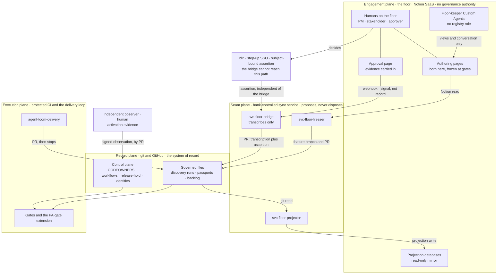

# The Factory Floor seam — threat model and capability matrix

**Status:** DRAFT — not reviewed, not approved · **Deliverable:** WS0 · Decision D0.4 part 1 (prerequisite
P6) · **Date:** 2026-07-25 · **Owner:** AWAITING: D0.4 owner — name, date
**Companions:** `docs/notion-floor-plan.md` (v2 — findings F1–F4, goals G1–G6, prerequisites
P1–P6) · `docs/research/notion-software-factory-collaboration-2026-07.md` (governing rules §4.1,
storage split §6) · `plugins/middleleap-loom/skills/loom/references/governance.md` (the HG catalog).

This document models the seam between **the floor** (Notion) and **the record** (git/GitHub) — what
crosses it, who may cross it, and what happens when someone or something crosses it who should not.
It exists because the external control review found four defects (F1–F4) whose common root is that
the seam's original design let a *machine's* signature stand in for a *human's* decision. Part 1
delivers the trust boundaries, the STRIDE threat table, the per-identity capability matrix, and the
abuse cases that make goal G2's negative suite executable. Part 2 — the Notion → IdP → registry
identity mapping and the automated pre-egress filter design — is a separate document and is **not**
covered here. Nothing in this file is a control until its own observation lands; every statement of
enforcement below is a *design intent* pending the sign-offs listed in §8.

## 0 · How to read this, and what it does not claim

- **Nothing here is approved.** Where a human decision, a name, or a date is required, this file
  carries an explicit `AWAITING:` placeholder. An unfilled placeholder is a gap, not a formality.
- **No control described below is active.** Per the honesty rule (plan §9), every adapter and
  projection ships *declared, not active* until its first real observed evidence. Several controls
  named here do not yet exist in the harness at all; those are marked in the residual column and
  collected in §8.
- **Residual ratings.** **High** — a single failure can place an unauthorised or unbound approval
  into the record, or restricted data onto the floor, with no other control in the path. **Medium**
  — a single failure misleads humans, or needs a second failure (typically a human merge) to reach
  the record. **Low** — the failure is refused by a mechanism that ships today and is
  negative-tested. Where a rating changes when D2.4/D2.5 land, both are given.
- **Silence is not coverage.** Threats this model does not cover are named in §7, not omitted.

## 1 · Scope

**In scope:** the seam itself — the four split service identities of prerequisite P4, the data and
events that cross between Notion and git/GitHub in either direction, the approval round-trip, the
freeze round-trip, the projection, and the floor-keeper Custom Agents that operate beside them.

**The assets an attacker or a mistake is after:**

| Asset | Why it matters | Where it lives |
|---|---|---|
| **Approval authority** (PA1/PA2, A1–A5, the compiled role set) | The one thing the floor must never acquire | `product-passport.json` + the extended PA gate, git |
| **The control plane** | CODEOWNERS, workflows, gate scripts, managed settings, `release-hold.json`, `identities.json`, `attestation-issuers.json`, adapters (HG-0002) | git, second-line/platform CODEOWNERS |
| **The frozen record's integrity** | A discovery artifact of record must be what the page said, byte for byte | `discovery/runs/<slug>/` + the freeze stamp digest |
| **Restricted content** | Personal data, passport free text, risk ratings, customer categories (PDPL, HG-0011) | must not leave git for the floor except per P1 |
| **Credentials** | Three service tokens, three signing keys, one observer key | vault (HG-0004) |
| **The seam's truthfulness** | A stale or paused floor that still looks live is a control failure of its own | projection freshness, degradation banner |

**The identities that cross the seam** (P4 — one capability each, no identity holds two halves):

| Identity | Kind | Runs where | Its one job | It can never |
|---|---|---|---|---|
| `svc-floor-projector` | service | bank-controlled service (or a Worker, projection only, per P5) | git read → Notion write | write git; touch an approval field |
| `svc-floor-freezer` | service | bank-controlled service | Notion read → feature-branch + PR write | merge; write Notion; consume webhooks |
| `svc-floor-bridge` | service | bank-controlled service | webhook read + transcription; packages an assertion it did not mint | **issue an approval assertion**; merge; write Notion |
| **Independent observer** | **human** (platform role, separately keyed) | outside the agent's and the seam's write authority | produce and sign activation evidence for the seam | approve a product decision; toggle the mechanism it observes (§8 G-5) |
| Floor-keeper Custom Agents | agent | Notion workspace | prefill non-judgment fields; converse | hold a registry role; hold any grant on an authoritative field |

## 2 · Trust boundaries — the four planes

Four planes, three boundaries, and one path that must bypass the seam entirely.

- **Engagement plane — the floor.** Notion SaaS: authoring pages, projection databases, approval
  pages, comments, floor-keeper agents, and the humans. Outside the bank's perimeter. **Holds no
  governance authority.** Everything here is either a mirror of the record, a draft awaiting a
  freeze, or a conversation.
- **Seam plane — the sync service.** The three machine identities, bank-hosted (P5). The only place
  the two sides touch. It **proposes**; it never disposes (HG-0013 — the PR is the light switch).
- **Record plane — git and GitHub.** Governed files, the control plane, CODEOWNERS, branch
  protection. The system of record. Every fact a gate trusts lives here.
- **Execution plane — protected CI and the delivery loop.** Where the gates actually run, and where
  `agent-loom-delivery` works. It reads the record; it has no path to the floor.

| # | Boundary | What crosses | Direction | Authenticated by | Fails how |
|---|---|---|---|---|---|
| **TB-1** | floor ↔ seam | projected state; page content for export; webhook events | both | integration token (out); `X-Notion-Signature` + event-id dedupe (in) | a spoofed or replayed event; an over-broad token |
| **TB-2** | seam ↔ record | feature branches, PRs, envelopes, transcriptions | seam → record only | GitHub identity per service identity; ed25519/CI-OIDC/sigstore issuer registry | a service identity that can merge collapses four-eyes (HG-0001) |
| **TB-3** | record ↔ execution | gate scripts, workflows, managed settings | record → execution | protected CI, immutable control plane (HG-0002) | an agent that can edit its own guardrails |
| **TB-0** | human ↔ IdP | the subject-bound decision assertion | human → IdP → record | step-up SSO / observed IdP assertion / Sigstore-style token — **mechanism AWAITING** (plan §7.5) | if this path runs *through* the bridge, F1 is unfixed |

**TB-0 is the correction.** The bridge may *carry* an assertion — it is a courier — but the
assertion must be minted on a path the bridge cannot reach and must itself bind the change, the
stage and the subject, so that a dropped or swapped assertion fails verification rather than
degrading into a bridge-signed claim. The bridge's signature proves the bridge transcribed. It has
never proved, and must never be read as proving, that a named human decided.

Read as text: **git → projector → floor** is the only write path onto the floor. **floor → freezer
→ PR** and **webhook → bridge → PR** are the only write paths toward the record, and both stop at a
PR that a second human merges. **human → IdP → assertion** is the only path by which a decision
acquires validity, and it does not pass through any service identity. **observer → activation
evidence** is the only path by which the seam may claim to be live. There is no arrow from any
plane into the control plane except a human PR under CODEOWNERS.

## 3 · Threat table

STRIDE categories: **S** spoofing · **T** tampering · **R** repudiation · **I** information
disclosure · **D** denial of service · **E** elevation of privilege.

| # | STRIDE | Threat | What it achieves | Control that answers it | Residual |
|---|---|---|---|---|---|
| **T-01** | S·T | **Forged or replayed approval envelope** — an envelope is crafted, or a valid old one resubmitted, to satisfy a PA gate | An unauthorised change passes PA1/PA2 with an approval no human issued for it | D2.4 binds change id · PA stage · outcome · role · `plan_hash` · content digests · event id · decision nonce · schema version · expiry. D2.5 verifies the signature against `attestation-issuers.json` (`core/attestations.mjs` → `verifySignatureOver`), rejects expired and already-seen nonces, and still requires a CODEOWNERS merge | **High today** — `product-approval-check` reads no attestations at all (F3), so any envelope is decorative → **Low** after D2.4/D2.5, subject to the replay ledger of §8 G-4 |
| **T-02** | S | **A bot or agent approves** — a Custom Agent, workspace bot, or automation clicks approve, or an agent id appears as approver | Machine judgment is laundered into human accountability; four-eyes becomes one-eye | Three layers: the bridge rejects webhook authors of type `bot`/`agent` (D5.2); `identity-registry-check` fails the build if any agent identity holds a role; `resolveApprover` emits *"is an AGENT — agents prepare evidence, they never approve"*; floor-keepers hold no grant on approval fields (D6.3) | **Low** for the machine path — the registry half ships and is negative-tested. **Medium** for the human proxy: a person who clicks approve on an agent's recommendation without reading is invisible to every gate (the method's standing comprehension-debt risk) |
| **T-03** | S·E | **The bridge fabricates a decision (F1)** — a compromised or buggy bridge signs an envelope naming an approver who never decided | Any registered human's approval can be manufactured for any change | The bridge holds **no approval-assertion capability** (matrix C10 = no). Validity comes only from a subject-bound assertion minted on TB-0, which the bridge cannot reach; the extended gate verifies the *assertion's* issuer, never the bridge's | **High today** — the design is agreed, the mechanism is not (open decision 5), and the issuer registry cannot express "this issuer may sign transcriptions but not approvals" (§8 G-1) → **Low** once both land |
| **T-04** | T | **Post-decision mutation of approved content (F2)** — evidence, passport sections, or source change after the click; the old approval still verifies | An approval granted for one thing silently covers another | The envelope binds digests, not references: frozen passport/content digest, source sha (PA1) or artifact/evidence digest (PA2), `plan_hash`. The gate recomputes and compares. On the floor, D4.2 raises drift and blocks new freeze/approval claims until re-frozen | **High today** → **Medium** after D2.4: the control is only as complete as the digest set. Rule to enforce: **an approval may cite only evidence the envelope digests.** Evidence living solely on the floor stays mutable |
| **T-05** | S·T | **Approval bound to the wrong subject (F2)** — an approval for change A counts for change B, PA1 counts as PA2, or role X's decision fills role Y's slot | Approver sets are satisfied by decisions that were never about this change or this stage | D2.4's subject binding (change id + stage + outcome + role) checked by D2.5 against the compiled plan; the gate already refuses an approver who does not hold the role (*"does not hold the required role"*) | **High today** — v1's envelope omitted stage and outcome entirely → **Low** after D2.4/D2.5 |
| **T-06** | S·T·D | **Webhook loss, replay, reordering or spoofing** | A freeze or decision is missed; a duplicate PR is opened; state is applied out of order; a forged event drives the bridge | D4.3: verify `X-Notion-Signature`; deduplicate on event id; **refetch current state before acting**; never assume ordering or exactly-once. Webhooks are signals, not records. Loss is covered by a reconciliation poll (cadence AWAITING, plan §7.3) | **Medium** — spoof and replay are answered; **loss is silent** until reconciliation runs, and the signature authenticates the *workspace*, not the person who acted |
| **T-07** | T·R | **Exporter nondeterminism** — the frozen markdown is not what the page said, or two exports of one page differ | A gate passes on a record that misrepresents what the team agreed; the audit trail is quietly wrong | D4.1 fails closed on unknown or unsupported blocks, truncation, and permission gaps; the export digest is recorded in the freeze stamp; D3.1's parity check compares section lists in CI | **Medium** — fail-closed catches the known-unknown; a silently dropped comment thread or view is not detectable by digest alone. Needs a golden-file corpus per block type, re-run whenever the API pin (D0.5) moves |
| **T-08** | S·E | **Token or credential compromise, per identity** | *projector:* write false state onto the floor (misleads humans, no gate effect) · *freezer:* open PRs carrying forged discovery content · *bridge:* submit transcriptions and proposals · **observer key: sign false activation evidence, making a dead control look live** | Vaulted, per-identity credentials (HG-0004); no shared token; rotation; no key on the agent's disk; four-eyes on every PR limits every machine compromise to a *proposal* | **Medium** for the three service tokens — a human merge stands between compromise and record. **Medium–High for the observer key**: it is the one key whose misuse creates belief in a control rather than a proposal. Two-observer countersignature is AWAITING (§8 G-5) |
| **T-09** | E | **Privilege creep across the four identities** — over time the bridge gains a Notion write, the freezer gains webhook read, or the three are merged back into one app for convenience | v1's single `svc-floor-sync` returns; one compromise gets the whole seam | The matrix in §4 is the contract, not documentation; capability **probes** run per release. The plan already requires two: the projector cannot write git (WS1), the freezer cannot merge its own PR (WS4) | **Medium** — the matrix asserts 99 cells; the plan probes 2. Which cells get automated probes is AWAITING (§8 G-6). Creep is gradual, well-intentioned, and invisible without a probe |
| **T-10** | I | **Over-projection of restricted content** — the projector pushes personal data, passport free text, risk ratings or customer categories to the SaaS floor | A PDPL/HG-0011 breach with no attacker required; the residency position is lost at the first sync | P1's residency record defines the projectable classes (references + status; passport fields as summaries; never personal data), signed and in git. The automated pre-egress filter (D0.4 part 2) is **allow-list, fail-closed**. Catalog C templates carry PII discipline by construction | **High until part 2 lands and is negative-tested.** Note honestly: even a compliant projection of identifiers (identity ids, change ids, role names) discloses organisational structure to the vendor — AWAITING: data-protection ruling on identifier projection |
| **T-11** | T·R | **Stale projection presenting false state** — the board shows approved, held, or released when git says otherwise, and someone acts on it | Human decisions taken against a false picture; the floor manufactures the appearance of control | G4's 10-minute freshness measure; every projected surface stamps *projected from `<sha>` at `<time>`* and **degrades visibly** past the window; the drift badge; `release-hold.json` rendered as a card with no inputs by design | **Medium** — this is the most likely everyday failure and it touches no gate (no gate reads the floor). The requirement is that staleness be *loud*: greyed, banner, timestamp — never a plausible-looking board |
| **T-12** | E | **A floor-keeper agent reaches an authoritative field** — a Custom Agent with a workspace grant edits an approval property, an evidence block, or a people-property | A machine edits the surface humans read before deciding; an approval field is prefilled by the thing being approved | D6.3: approval fields live in databases where floor-keepers hold **no grant at all**; agent write scope is views + conversation; no floor-keeper holds a registry role; and any floor edit is void because the record is git | **Medium** — governance impact is Low (git is the record), confusion impact is real: Notion grants are page/database-level, **not property-level**, so separation depends on a page never being filed in the wrong database. Needs a periodic grant audit — owner AWAITING |
| **T-13** | D | **Credit exhaustion silently pauses automation** — Custom Agents and Workers stop; prefill stops; the floor looks calm | Work quietly stops routing; the floor's calm is mistaken for "nothing to do" | D6.4: a reconciliation job plus a documented manual fallback; **projection does not depend on credits** (the projector is a bank-hosted service, not a Worker); a visible degraded banner; an alert at a credit threshold | **Medium** — the failure mode is *silence*, and silence must never be mistaken for coverage. AWAITING: credit threshold, alert route, and named owner |
| **T-14** | S | **Identity-mapping drift** across Notion ↔ IdP ↔ registry — a leaver still resolves; an email change breaks the join; two Notion accounts map to one subject | An approval resolves to a subject who should no longer hold it, or to the wrong person entirely | Part 2 keys the mapping on the **immutable IdP subject**, never on email or a Notion person id alone; joiner-mover-leaver reconciliation; the extended gate rejects unmapped subjects and verifies the mapping **at gate time**, not at click time | **High until part 2 lands** — this is the single join the entire approval chain rests on and the one with no gate today. Compounded by §8 G-3: the shipped sigstore issuer binds on an email `subject_pattern`, and email is mutable |
| **T-15** | T·E | **Supply-chain compromise of the sync service** — a dependency or base image of the bank-hosted freezer/bridge is compromised | All three service tokens and the whole PR path in one step | HG-0002's supply-chain half applied to the sync service *itself*: hardened images, signed SBOM, SLSA provenance, and its own change class — it is a governed component, not glue. No merge capability caps the blast radius at proposals; four-eyes is the backstop | **Medium** — the sync service is new code outside the harness's zero-dependency core, and the harness's own supply-chain gate does not cover it today. AWAITING: decision on whether the sync service is itself a Loom-governed repository |

## 4 · The capability matrix

Columns (each cell is an explicit **yes** or **no**; bracketed letters point to the scope notes
below):

| Col | Capability |
|---|---|
| **C1** | read git |
| **C2** | write git branch |
| **C3** | open PR |
| **C4** | **merge PR** |
| **C5** | **write control plane** (CODEOWNERS, workflows, gates, managed settings, `release-hold.json`, `identities.json`, `attestation-issuers.json`) |
| **C6** | read Notion |
| **C7** | write Notion projection |
| **C8** | read webhooks |
| **C9** | sign transcription (attest "this is what I read") |
| **C10** | **issue approval assertion** (assert "this human decided this") |
| **C11** | produce activation evidence |

| Identity / role | C1 | C2 | C3 | C4 | C5 | C6 | C7 | C8 | C9 | C10 | C11 |
|---|---|---|---|---|---|---|---|---|---|---|---|
| `svc-floor-projector` · service | yes (a) | no | no | **no** | **no** | yes (b) | yes | no | no | **no** | no |
| `svc-floor-freezer` · service | yes | yes (c) | yes | **no** | **no** | yes (d) | no | no (e) | yes (f) | **no** | no |
| `svc-floor-bridge` · service | yes | yes (c) | yes | **no** | **no** | yes (g) | no | yes | yes (f) | **no** | no |
| Floor-keeper Custom Agents · agent | no | no | no | **no** | **no** | yes (h) | no | no | no | **no** | no |
| `agent-loom-delivery` · agent | yes | yes | yes | **no** | **no** | no | no | no | no | **no** | no |
| Builder · human, first line | yes | yes | yes | yes (i) | **no** | yes (j) | no | no | no | yes (k) | no |
| Second line · human | yes | yes | yes | yes | yes | yes (j) | no | no | no | **yes** | no |
| Platform observer · human (P4's independent observer) | yes | yes | yes | no (l) | no (m) | yes (j) | no | no | no | **no** | **yes** |
| Other registered role-holder · human (product-owner, accountable-executive, legal, operations, institutional-context-owner) | yes | no (n) | no (n) | no | **no** | yes (j) | no | no | no | **yes** (o) | no |

**Scope notes.** (a) read-only, scoped to the projectable classes P1 permits · (b) projection
databases only, to reconcile what it wrote · (c) feature branches only; never `main`; never a
control-plane path · (d) authoring pages only, for export · (e) freeze is an explicit human intent
(plan §7.2); a freeze request reaches the freezer as a verified, deduplicated instruction from the
bridge, and the freezer refetches page state itself before exporting (D4.3) · (f) signs *what it
read*, never *what a human decided* — the distinction F1 turns on · (g) refetch-before-act only
(D4.3) · (h) non-authoritative databases only; no grant of any kind on approval fields (D6.3) ·
(i) never their own PR; never a CODEOWNERS-protected path · (j) the floor as a reader, like any
teammate · (k) **only for a non-second-line compiled role the builder actually holds** — the
reference registry now places the architects in the builders group (`eng-omar`: engineering +
enterprise-architect; `arch-tariq`: solution-architect), so a builder-held role is the normal case,
not the exception. A builder issuing a *second-line* approval is refused: *"is in the builders group
— a builder cannot issue second-line approval"*. See §8 G-9 for what that leaves open · (l) a second
human merges the observer's own activation-evidence PR — an observer who lands their own evidence
is self-attesting · (m) see §8 G-5: the observer who signs a bypass test must not hold the toggle
for the mechanism they tested; `platform-activation-check` does not enforce this today · (n) G1's
whole point is that these roles never need git; nothing bars an adopter from granting it, and the
four-eyes rules are unchanged if they do · (o) via TB-0, for the compiled roles they hold — this is
the row that makes the matrix's headline true.

**What the matrix is for.** Three claims must be readable straight off it:

1. **C4 — no service identity and no agent can merge.** Five rows, five `no`. Four-eyes (HG-0001)
   is unreachable from the seam by construction, not by policy.
2. **C10 — only humans approve.** Every machine row is `no`; **including `svc-floor-bridge`**. The
   bridge can sign C9 and never C10, which is precisely the F1 correction rendered as a capability.
3. **C5 — only the second line writes the control plane.** The seam, the agents, and the builders
   are all `no`; `release-hold.json` is reachable from the floor only as a card with no inputs.

The matrix is 9 rows × 11 columns = **99 cells**. Two of them are probed today (WS1: the projector
cannot write git; WS4: the freezer cannot merge). The other 97 are asserted. Asserted separation
is documentation; probed separation is a control — see §8 G-6.

## 5 · Abuse cases — the negative suite

These are goal G2's seven negatives, written so they can be executed rather than asserted. The
suite runs in every milestone review that touches WS5 (plan §9), and M4 is not done until all seven
pass **in reality**, not against fixtures alone.

| # | Abuse case | Action attempted | Expected outcome | Enforced by | Demonstrable today? |
|---|---|---|---|---|---|
| **AC-1** | **Agent or bot approval rejected** | A floor-keeper agent (or any Notion author of type `bot`/`agent`) approves on the approval page; separately, an agent id is placed in a passport approval | Event dropped at the bridge with a recorded reason; build fails with *"is an AGENT — agents prepare evidence, they never approve"*; registry check fails if an agent identity holds any role | `svc-floor-bridge` author-type filter (D5.2) · `identity-registry-check.mjs` · `product-approval-check.mjs` | Registry half: **yes, today**. Webhook half: needs D5.2 |
| **AC-2** | **Unregistered human rejected** | A real person who is not in `identities.json` approves on the floor | The bridge refuses to open a PR because the Notion person id does not map to a registry subject; if it reaches git anyway, the gate emits *"identity … is not in the registry — unresolvable approvals do not count"* | P6 mapping (part 2) · `resolveApprover` | Registry half: **yes, today**. Mapping half: needs part 2 |
| **AC-3** | **Role-less approver refused at drafting** | A registered human who does not hold the compiled role is offered, and attempts, the approval | The approval page's people-property does not offer them (refusal at drafting time — the friendly half); if they get there anyway the gate emits *"does not hold the required role `<role>`"* | D5.1 people-property resolved through P6 · `product-approval-check.mjs` | Gate half: **yes, today**. Drafting half: needs D5.1. **Drafting-time refusal is UX, not control** — the gate is the control of record |
| **AC-4** | **Release-hold write rejected by the platform** | `svc-floor-freezer` or `svc-floor-bridge` attempts to write `release-hold.json`, or to land a PR touching it without second-line review | Rejected by CODEOWNERS + branch protection; the refusal is captured as the `github-codeowners-hold` adapter's activation evidence | GitHub branch protection · CODEOWNERS (HG-0001/HG-0002) | **Yes**, once the identities exist. Per F4, this proves **platform protection only** — it says nothing about whether a Notion approval was authentic; that is AC-1/AC-2/AC-6's stream |
| **AC-5** | **Stale activation distrusted by the gate** | An activation record for the seam is presented with `observed_at` outside the freshness window, or dated in the future | `platform-activation-check.mjs` fails on freshness and refuses the `platform-enforced` claim | `platform-activation-check.mjs` (default window 365 days) | **Partly.** Two blockers: the default window is far too long for a seam whose freshness target is 10 minutes, and `notion-activation` has **no valid `mechanism` value** in the shipped enum — see §8 G-2 |
| **AC-6** | **Replayed event rejected** | The same webhook event id is delivered twice; separately, a previously-valid envelope is resubmitted after the plan recompiles | Bridge dedupes on event id and no-ops; the extended gate rejects an envelope whose nonce is already recorded, whose `plan_hash` no longer matches the compiled plan, or whose expiry has passed | D4.3 dedupe · D2.4 nonce/expiry · D2.5 verification | **No** — needs D4.3 + D2.4/D2.5 and the replay ledger of §8 G-4 |
| **AC-7** | **Post-decision mutation detected** | The approved passport section, evidence block, or source sha changes after the approval | The gate recomputes the digests the envelope binds and fails on mismatch; on the floor the drift badge flips and D4.2 blocks a new freeze or approval claim until re-frozen. **Merged records are never retroactively invalidated** | D2.4 digests · D2.5 comparison · D4.2 drift | **No** — needs D2.4/D2.5 + D4.2 |

**Two further negatives are proposed for the suite** (not in G2 as written; AWAITING: decision to
adopt): **AC-8** — an envelope whose approval assertion is issued by the bridge's own issuer is
rejected, proving T-03's control rather than assuming it. **AC-9** — a projection run containing a
field outside the P1 allow-list is blocked by the pre-egress filter and fails closed, proving T-10.

## 6 · Assumptions

1. **Branch protection is activated, not merely configured.** The whole model rests on GitHub
   refusing a merge. The origin repository's catalog exists because an agent identity once merged
   to `main` with protection configured and inactive. Every claim here inherits that dependency.
2. **The sync service is bank-controlled** (P5), with its own change management and supply-chain
   posture. Notion Workers carry projection only, and only while Workers remain beta.
3. **Notion page/database grants are the coarsest available separation.** There is no
   property-level protection; §4 and D6.3 are built around that limitation, not despite it.
4. **The REST API version is pinned** per D0.5. Vendor behaviour changes on the vendor's schedule;
   exporter determinism (T-07) is re-established after every pin move.
5. **Every human in the chain exists in the IdP with an immutable subject and in
   `identities.json`.** Part 2 defines the join; until it exists, T-14 has no control.
6. **The floor sits outside the bank's residency perimeter** unless the P1 record says otherwise.
7. **Threat actors modelled:** an external attacker holding a stolen credential; a careless or
   curious insider; a well-meaning automation exceeding its remit; a compromised dependency.
8. **No control here is active.** Each is declared until its own observation lands (plan §9).

## 7 · Out of scope

- **The identity mapping's mechanics and the pre-egress filter design** — D0.4 part 2.
- **The choice of human-assertion mechanism** (step-up SSO vs observed IdP assertion vs
  Sigstore-style token) — plan open decision 5, settled at the WS5 entry-gate review.
- **Notion's own security posture, subprocessors, and vendor due diligence** — the third-party risk
  track. AWAITING: third-party risk assessment reference — owner, date.
- **The threat model of the product being built.** This covers the seam only; a change's own risks
  run through D6, the mounted data-risk register, and the compiled control plan.
- **Collusion between two authorised humans, coercion of an approver, and endpoint compromise of an
  approver's device.** Named honestly: a subject-bound assertion is only as strong as the device
  that produced it, and no control in this model detects a coerced but genuine approval.
- **A malicious second-line insider.** The model assumes the second line is trustworthy; that is a
  control-environment assumption, not a technical one.
- **Availability and disaster recovery of the Notion workspace**, beyond D6.4's requirement that
  degradation be visible.
- **Cost and credit budgeting** (P2), except where exhaustion becomes a silent control failure
  (T-13).
- **Non-Notion instantiations of the same seam.** The crosswalk is vendor-neutral (HG-0008); this
  model covers Notion as its reference instantiation and would need re-running for Jira, Linear or
  Confluence.

## 8 · Known gaps, and what is awaiting a human

Each gap below is a place where this model names an intent the harness cannot currently enforce.
None may be closed by assertion.

| # | Gap | Consequence if unclosed | Needed |
|---|---|---|---|
| **G-1** | `attestation-issuers.json` has **no envelope-kind scope** on an issuer — nothing expresses "this issuer may sign transcriptions but never approval assertions" | T-03's control is procedural: a bridge issuer accepted for one kind is accepted for all | Upstream WS2 change: per-issuer allowed evidence kinds, enforced in `core/attestations.mjs`. AWAITING: decision — owner, date |
| **G-2** | `platform-activation-check.mjs` restricts `mechanism` to `branch_protection · rulesets · required_reviews · codeowners · workflow_permissions · environment_protection · oidc_subjects` — **no seam mechanism exists**, and the freshness window defaults to 365 days | D5.3's `notion-activation` stream cannot be verified by the shipped gate, and a year-old seam observation would pass if it could | Upstream enum extension plus a seam-appropriate `max_age_days`. AWAITING: proposed window — owner, date |
| **G-3** | The shipped sigstore issuer binds on an email `subject_pattern` | Email is mutable; the binding drifts with a name change (compounds T-14) | Bind on the immutable IdP subject in part 2 and in the issuer entry |
| **G-4** | The **replay ledger** — where used (event id, nonce) pairs live, who owns the file, how it is pruned, and how it behaves on a fork — is undesigned | AC-6 cannot be executed; T-01's residual stays High | Design in D2.4/D2.5. AWAITING: owner, date |
| **G-5** | Nothing prevents the **independent observer from being the platform admin who can toggle the mechanism they tested** — `platform-activation-check` requires only that the observer is not an agent and not a builder | A bypass test signed by the person holding the bypass is self-attestation with extra steps | Separate the observer hat from the toggle-holding admin hat, or require a second platform admin's countersignature. AWAITING: decision — owner, date |
| **G-6** | **2 of 99** capability-matrix cells are probed | T-09's privilege creep is invisible between reviews | Decide the probe set and wire it into CI. AWAITING: decision — owner, date |
| **G-7** | The **pre-egress filter** is designed in part 2, not here | T-10 stays High; P1 has no automated enforcement | D0.4 part 2 |
| **G-8** | The **sync service's own governance** — is it a Loom-governed repository with its own change class, or adopter glue? | T-15 has no owning control | AWAITING: decision — owner, date |
| **G-9** | **Builder-held compiled roles.** The architects sit in the builders group, so a builder can hold a compiled approver role. `product-approval-check` refuses a builder only for *second-line* roles; nothing refuses a first-line role-holder approving a change they themselves authored | On the floor this becomes a one-click self-approval for the architecture roles, with only the four-eyes merge behind it | Decide whether the extended gate adds a same-subject-as-author refusal for compiled first-line roles. AWAITING: decision — owner, date |

### Sign-offs required before this document counts

This is a draft. It becomes a deliverable when the following are recorded, each as a signed record
in git alongside the P1 residency record:

- AWAITING: information-security sign-off — name, date
- AWAITING: data-protection sign-off (T-10 identifier-projection ruling included) — name, date
- AWAITING: risk (second line) sign-off — name, date
- AWAITING: platform-admin sign-off on the capability matrix and the probe set — name, date
- AWAITING: the independent second-line review of WS5's design (plan §4, WS5 entry gate) — name,
  date

Until every line above carries a name and a date, WS5 surfaces run **labelled non-authoritative**,
and no adapter derived from this model may report anything other than *declared, not active*.
